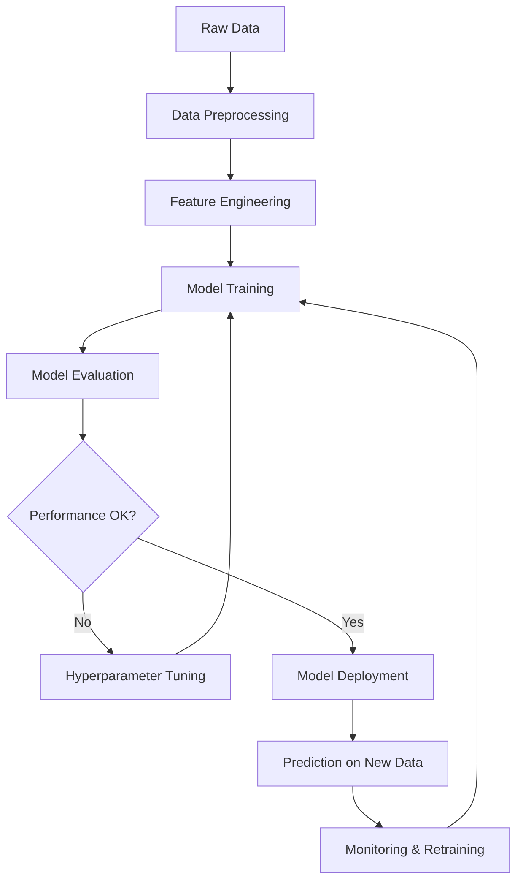

# Session 1 – Information Theory & ML Foundations

## 📚 Table of Contents
1. [Information Theory](#information-theory)
2. [Machine Learning Overview](#machine-learning-overview)
3. [Types of Machine Learning](#types-of-machine-learning)
4. [PAC Learning](#pac-learning)
5. [Uses of ML](#uses-of-ml)
6. [Evaluating ML Techniques](#evaluating-ml-techniques)
7. [MCQs](#mcqs)
8. [Common Mistakes](#common-mistakes)
9. [One-Line Exam Facts](#one-line-exam-facts)

---

# Information Theory - Simple Explanation

## What is Information Theory?

**Information Theory** is a mathematical way to measure uncertainty and information. Think of it as a system for answering: *"How surprising is this outcome?"*

Created by **Claude Shannon** in 1948, it helps us understand how to store, compress, and transmit information efficiently.

---

## The Core Idea: Entropy

**Entropy** measures how **unpredictable** something is. It answers: *"How much do I need to know to remove all uncertainty?"*

### Simple Analogy
Imagine guessing what's in a box:

- **High Entropy Box**: Could contain 100 different items equally likely → Very unpredictable, need lots of questions
- **Low Entropy Box**: Almost always contains an apple → Very predictable, need few questions
- **Zero Entropy Box**: Always contains exactly one apple → Completely predictable, no questions needed

---

## The Formula Explained Simply

```
H(X) = -Σ pᵢ log₂(pᵢ)
```

Don't let this scare you! Here's what it means:

- **pᵢ** = probability of each outcome
- **log₂(pᵢ)** = how "surprising" that outcome is
- **Σ** = add up across all possible outcomes
- **Result (H)** = average surprise, measured in "bits"

---

## Real Examples

### Example 1: Fair Coin Flip

- 50% heads, 50% tails
- **Entropy = 1 bit**
- Translation: "I need 1 yes/no question to know the result"
- Maximum uncertainty for 2 outcomes

### Example 2: Biased Coin

- 90% heads, 10% tails
- **Entropy ≈ 0.47 bits**
- Translation: "Less than 1 question needed on average because it's usually heads"
- Lower uncertainty

### Example 3: Rigged Coin

- 100% heads, 0% tails
- **Entropy = 0 bits**
- Translation: "No questions needed, I already know the answer"
- No uncertainty

---

## Why This Matters in Machine Learning

1. **Decision Trees**: Choose features that reduce entropy most (reduce uncertainty about the answer)
2. **Data Compression**: High entropy data is hard to compress (it's already unpredictable/random)
3. **Feature Selection**: Features with low entropy don't tell us much (they're too predictable)
4. **Model Training**: We want to reduce the entropy of our predictions (make them more certain)

---

## Key Takeaways

- **Entropy = Uncertainty = Surprise = Information Content**
- **More unpredictable** = Higher entropy = More bits needed
- **More predictable** = Lower entropy = Fewer bits needed
- **Completely certain** = Zero entropy = No bits needed

**Think of entropy as measuring "How many yes/no questions do I need to ask to figure this out?"**

---

# Conditional Entropy & Mutual Information - Simple Explanation

## 2. Conditional Entropy H(Y|X)

### What is it?
**Conditional Entropy** measures: *"How much uncertainty remains about Y after I already know X?"*

### Simple Analogy
Imagine guessing someone's mood (Y):

- **Before knowing anything**: High uncertainty
- **After knowing it's their birthday** (X): Lower uncertainty (probably happy!)
- **Remaining uncertainty**: That's conditional entropy

### The Key Property
Knowing something **always reduces (or keeps the same) uncertainty**:

- **H(Y|X) ≤ H(Y)**
- If X tells you everything about Y: **H(Y|X) = 0**
- If X tells you nothing about Y: **H(Y|X) = H(Y)**

---

### Real Example: Email Spam Detection

**Scenario**: Classify emails as Spam or Not Spam

#### Before knowing anything:
- 40% Spam, 60% Not Spam
- **Entropy = 0.971 bits** (quite uncertain)

#### After seeing the word "Free":

**If email contains "Free":**
- 80% Spam, 20% Not Spam
- **Entropy = 0.722 bits** (more certain it's spam!)

**If email doesn't contain "Free":**
- 10% Spam, 90% Not Spam  
- **Entropy = 0.469 bits** (pretty certain it's not spam!)

#### Average remaining uncertainty (weighted by how often "Free" appears):
- 30% of emails have "Free", 70% don't
- **H(Class|Free) = 0.3 × 0.722 + 0.7 × 0.469 = 0.545 bits**

**Key insight**: We reduced uncertainty from **0.971 to 0.545 bits** by checking for "Free"!

---

## 3. Mutual Information I(X;Y)

### What is it?
**Mutual Information** measures: *"How much does knowing X reduce my uncertainty about Y?"*

### Simple Formula
```
I(X;Y) = H(Y) - H(Y|X)
       = Uncertainty before - Uncertainty after
       = Information gained
```

### The Venn Diagram Way
Think of two overlapping circles:
```
[What only X tells you]  [Shared info]  [What only Y tells you]
         H(X|Y)            I(X;Y)           H(Y|X)
```

The **overlap** is Mutual Information - information shared by both X and Y.

---

### Email Example Continued

```
I(Free; Spam) = H(Spam) - H(Spam|Free)
              = 0.971 - 0.545
              = 0.426 bits
```

**Translation**: The word "Free" gives us **0.426 bits** of information about whether an email is spam.

**This is exactly what Information Gain means in decision trees!**

---

### Key Properties

1. **Always non-negative**: I(X;Y) ≥ 0
   - You can't lose information by observing something

2. **Zero when independent**: I(X;Y) = 0
   - If X tells you nothing about Y, mutual information is zero

3. **Symmetric**: I(X;Y) = I(Y;X)
   - Information shared goes both ways

4. **Maximum**: I(X;Y) ≤ min(H(X), H(Y))
   - Can't share more information than either variable contains

---

## 4. Cross-Entropy & KL Divergence

### Cross-Entropy H(P,Q)

**What it measures**: "How many bits do I need if I designed my code for distribution Q, but the real distribution is P?"

#### Simple Analogy
Imagine packing a suitcase:

- **P (reality)**: You're going to Alaska (need winter clothes)
- **Q (your guess)**: You packed for Hawaii (summer clothes)
- **Cross-Entropy**: How "inefficient" your packing is

#### In Machine Learning:
**Cross-Entropy Loss** measures how wrong your predictions are.

```python
# If true label is "cat" (100% cat, 0% dog)
# But model predicts: 70% cat, 30% dog
# Cross-entropy penalizes that 30% confidence in wrong answer
```

---

### KL Divergence D_KL(P||Q)

**What it measures**: "How different is P from Q?"

#### Formula
```
D_KL(P||Q) = Cross-Entropy(P,Q) - Entropy(P)
           = Extra bits needed because Q is wrong
```

#### Important Warning

**KL Divergence is NOT symmetric!**
- D_KL(P||Q) ≠ D_KL(Q||P)
- Going from P to Q is different than going from Q to P

#### Example
```
P: True distribution of animals in zoo (90% mammals, 10% birds)
Q: Your guess (50% mammals, 50% birds)

D_KL(P||Q) measures: How wrong your guess is from reality
D_KL(Q||P) measures: How wrong reality is from your guess (weird!)

In ML, we typically use D_KL(P||Q) where P = true, Q = model
```

---

## 5. Information Theory in Machine Learning - Summary Table

| ML Algorithm | How It Uses Information Theory |
|-------------|-------------------------------|
| **Decision Trees** | Split on features with highest Information Gain (Mutual Information) |
| **Neural Networks** | Use Cross-Entropy as loss function to measure prediction error |
| **Feature Selection** | Choose features with highest Mutual Information with target |
| **Logistic Regression** | Minimize Cross-Entropy between predictions and true labels |
| **GANs** | Use JS Divergence (symmetric KL) to match generator and real distributions |
| **Autoencoders** | Use KL Divergence to regularize the learned representations |

---

## Key Takeaways

1. **Conditional Entropy**: Remaining uncertainty after observation
   - Always ≤ original entropy (observation helps!)

2. **Mutual Information**: Reduction in uncertainty
   - Same as Information Gain in decision trees
   - Measures how much two variables tell you about each other

3. **Cross-Entropy**: Cost of using wrong distribution
   - Primary loss function for classification tasks

4. **KL Divergence**: Distance between distributions
   - Measures "how wrong" a model's distribution is
   - Not symmetric (order matters!)

**The Big Picture**: All these concepts measure different aspects of information, uncertainty, and how they change when we observe data or make predictions.

---

# Machine Learning Overview

## 📘 Definition

**Machine Learning** is a field of study that gives computers the ability to **learn from data** without being explicitly programmed.

### Formal Definition (Tom Mitchell, 1997)
> A computer program is said to **learn** from experience E with respect to some task T and performance measure P, if its performance on T, as measured by P, improves with experience E.

### Example Breakdown
- **Task (T)**: Classifying emails as spam or not spam
- **Experience (E)**: Database of labeled emails (spam/not spam)
- **Performance (P)**: Accuracy of classification on new emails

## 🧠 Core Components of ML Systems



### 1. Data
- **Training Data**: Used to learn model parameters
- **Validation Data**: Used to tune hyperparameters
- **Test Data**: Used to evaluate final performance

### 2. Model
Mathematical function that maps inputs to outputs:
```
y = f(x; θ)
```
where θ represents learnable parameters.

### 3. Loss Function
Measures how well the model performs:
```
L(y_true, y_pred)
```

### 4. Optimization Algorithm
Updates parameters to minimize loss:
```
θ ← θ - α ∇L(θ)  (gradient descent)
```

---

# Types of Machine Learning

## 1. Supervised Learning

### Definition
Learning from **labeled data** (input-output pairs).

### Objective
Find function f: X → Y that minimizes prediction error.

### Types

#### A. Classification
**Output**: Discrete class labels

**Examples:**
- Email spam detection (binary)
- Handwriting digit recognition (multi-class)
- Medical diagnosis (multi-label)

**Algorithms:**
- Logistic Regression
- Decision Trees
- Random Forest
- SVM
- Neural Networks

**Loss Functions:**
- Binary Cross-Entropy
- Categorical Cross-Entropy
- Hinge Loss (SVM)

#### B. Regression
**Output**: Continuous values

**Examples:**
- House price prediction
- Stock price forecasting
- Temperature prediction

**Algorithms:**
- Linear Regression
- Ridge/Lasso Regression
- Decision Trees
- Neural Networks

**Loss Functions:**
- Mean Squared Error (MSE)
- Mean Absolute Error (MAE)
- Huber Loss

### Assumptions
1. **IID assumption**: Training and test data are independently and identically distributed
2. **Sufficient labeled data** available
3. **Generalization**: Model performs well on unseen data

## 2. Unsupervised Learning

### Definition
Learning from **unlabeled data** (no output labels).

### Objective
Discover hidden patterns, structure, or relationships in data.

### Types

#### A. Clustering
**Goal**: Group similar data points together

**Examples:**
- Customer segmentation
- Document categorization
- Image compression

**Algorithms:**
- K-Means
- Hierarchical Clustering
- DBSCAN
- Gaussian Mixture Models

#### B. Dimensionality Reduction
**Goal**: Reduce number of features while preserving information

**Examples:**
- Data visualization (3D → 2D)
- Noise reduction
- Feature extraction

**Algorithms:**
- PCA (Principal Component Analysis)
- t-SNE
- Autoencoders

#### C. Density Estimation
**Goal**: Estimate probability distribution of data

**Algorithms:**
- Kernel Density Estimation
- Gaussian Mixture Models

### Challenges
- No ground truth to evaluate performance
- Defining "good" clusters is subjective
- Results can be sensitive to hyperparameters

## 3. Semi-Supervised Learning

### Definition
Learning from **partially labeled data** (small labeled set + large unlabeled set).

### Assumptions
1. **Smoothness**: Nearby points likely have same label
2. **Cluster**: Points in same cluster likely have same label
3. **Manifold**: Data lies on lower-dimensional manifold

### Techniques
- **Self-training**: Use model predictions as pseudo-labels
- **Co-training**: Train multiple models on different feature sets
- **Graph-based methods**: Propagate labels through similarity graph

### Use Cases
- Medical imaging (labeling expensive)
- Speech recognition (transcription costly)
- Web page classification

## 4. Reinforcement Learning

### Definition
Learning through **interaction** with environment via trial and error.

### Key Components
- **Agent**: Learner/decision maker
- **Environment**: What agent interacts with
- **State (s)**: Current situation
- **Action (a)**: What agent can do
- **Reward (r)**: Feedback from environment
- **Policy (π)**: Mapping from states to actions

### Objective
Maximize **cumulative reward** over time:
```
G_t = Σ γᵏ r_{t+k+1}
```
where γ ∈ [0,1] is discount factor.

### Examples
- Game playing (Chess, Go, Atari)
- Robotics (walking, grasping)
- Autonomous driving
- Resource allocation

### Algorithms
- Q-Learning
- SARSA
- Deep Q-Network (DQN)
- Policy Gradient Methods
- Actor-Critic
- PPO (Proximal Policy Optimization)

## 5. Self-Supervised Learning

### Definition
Create pseudo-labels from unlabeled data structure.

### Examples
- **Language models**: Predict next word (GPT)
- **Masked language modeling**: Predict masked words (BERT)
- **Contrastive learning**: Similar images should have similar representations (SimCLR)
- **Autoencoding**: Reconstruct input from compressed representation

### Key Idea
Design **pretext task** that forces model to learn useful representations.

## Comparison Table

| Aspect | Supervised | Unsupervised | Semi-Supervised | Reinforcement |
|--------|-----------|-------------|-----------------|---------------|
| **Labels** | Fully labeled | No labels | Partially labeled | Reward signal |
| **Goal** | Predict output | Find structure | Leverage unlabeled data | Maximize reward |
| **Feedback** | Explicit (labels) | None | Mixed | Delayed (rewards) |
| **Data Need** | Moderate | Large | Small labeled + Large unlabeled | Interaction data |
| **Examples** | Classification, Regression | Clustering, PCA | Text classification | Game playing |
| **Evaluation** | Clear metrics | Subjective | Clear metrics | Cumulative reward |

---

# PAC Learning

## 📘 Concept Overview

**PAC (Probably Approximately Correct) Learning** is a theoretical framework to analyze **learnability** and **sample complexity** of ML algorithms.

*Introduced by Leslie Valiant (1984), Turing Award 2010*

## 🧠 Intuition

Can we guarantee that:
1. With **high probability** (P)
2. The learned hypothesis is **approximately correct** (AC)
3. Given **enough samples**?

## 🧮 Mathematical Foundation

### Setup
- **Instance space**: X (e.g., all possible emails)
- **Concept class**: C (e.g., all possible spam filters)
- **Target concept**: c ∈ C (unknown true spam filter)
- **Hypothesis class**: H (e.g., linear classifiers)
- **Training data**: S = {(x₁,y₁), ..., (xₘ,yₘ)} drawn IID from distribution D

### Definition

A concept class C is **PAC-learnable** by hypothesis class H if:

For any:
- Target concept c ∈ C
- Distribution D over X
- Error parameter ε > 0 (approximation)
- Confidence parameter δ > 0 (probability)

There exists:
- Learning algorithm A
- Sample complexity m(ε, δ)

Such that:
```
P[error(h) ≤ ε] ≥ 1 - δ
```

where h = A(S) is the learned hypothesis from m ≥ m(ε, δ) samples.

### Key Parameters

#### 1. Error (ε)
```
error(h) = P_{x~D}[h(x) ≠ c(x)]
```
Maximum acceptable error rate on test data.

#### 2. Confidence (1-δ)
Probability that learned hypothesis achieves error ≤ ε.

#### 3. Sample Complexity m(ε, δ)
Minimum number of training examples needed to PAC-learn.

### Sample Complexity Bound

For **finite hypothesis space** |H| < ∞:

```
m ≥ (1/ε) [ln|H| + ln(1/δ)]
```

**Intuition:**
- Larger ε (tolerate more error) → fewer samples needed
- Smaller δ (want higher confidence) → more samples needed
- Larger |H| (more complex hypothesis space) → more samples needed

### Example Calculation

**Problem**: Learn axis-aligned rectangles in 2D plane

- **Hypothesis space**: All axis-aligned rectangles
- Want: ε = 0.1 (10% error), δ = 0.05 (95% confidence)
- |H| is infinite, but can be parameterized by 4 coordinates
- Effective VC dimension = 4

**Sample complexity**:
```
m ≥ (1/0.1) [4 + ln(1/0.05)]
  ≥ 10 × [4 + 2.996]
  ≥ 70 samples (approximately)
```

## ⚙️ PAC Learning Algorithm

### Generic PAC Learner

```python
def pac_learner(X_train, y_train, H, epsilon, delta):
    """
    PAC learning algorithm.
    
    Args:
        X_train: Training features
        y_train: Training labels
        H: Hypothesis class (list of candidate hypotheses)
        epsilon: Error tolerance
        delta: Confidence parameter
    
    Returns:
        Best hypothesis h with error ≤ ε with probability ≥ 1-δ
    """
    m = len(X_train)
    
    # Check if we have enough samples
    min_samples = (1/epsilon) * (np.log(len(H)) + np.log(1/delta))
    
    if m < min_samples:
        print(f"Warning: Need {min_samples:.0f} samples for PAC guarantee")
    
    # Find hypothesis consistent with training data
    best_h = None
    min_error = float('inf')
    
    for h in H:
        # Training error
        predictions = [h(x) for x in X_train]
        error = np.mean(predictions != y_train)
        
        if error < min_error:
            min_error = error
            best_h = h
    
    return best_h
```

## 🔄 Relationship to VC Dimension

**VC dimension** d provides tighter sample complexity bound:

```
m ≥ (c/ε) [d + ln(1/δ)]
```

where c is a constant (typically 8-16).

## ⚠️ Assumptions

1. **Realizability**: True concept c ∈ H (hypothesis class contains target)
2. **IID samples**: Training data drawn independently from same distribution
3. **Consistency**: Learner finds hypothesis with zero training error

### Agnostic PAC Learning

Relaxes realizability assumption:
- True concept c may not be in H
- Learn best approximation in H

```
P[error(h) ≤ min_{h'∈H} error(h') + ε] ≥ 1 - δ
```

## ⭐ Key Insights

1. **PAC guarantees are distribution-free**: Work for any D (unlike Bayesian methods)
2. **Sample complexity grows logarithmically** with |H| and 1/δ
3. **Sample complexity grows inversely** with ε
4. **Computational complexity** is separate concern (finding consistent hypothesis may be hard)

---

# Uses of ML

## 1. Computer Vision
- **Image Classification**: Medical diagnosis, object recognition
- **Object Detection**: Autonomous vehicles, surveillance
- **Semantic Segmentation**: Medical imaging, satellite imagery
- **Face Recognition**: Security, authentication
- **Image Generation**: Art, design, deepfakes

## 2. Natural Language Processing
- **Machine Translation**: Google Translate
- **Sentiment Analysis**: Social media monitoring, customer feedback
- **Text Summarization**: News aggregation
- **Question Answering**: Chatbots, virtual assistants
- **Named Entity Recognition**: Information extraction

## 3. Speech & Audio
- **Speech Recognition**: Virtual assistants (Siri, Alexa)
- **Speaker Identification**: Security, verification
- **Music Generation**: AI composers
- **Noise Cancellation**: Headphones, conferencing

## 4. Healthcare
- **Disease Diagnosis**: Cancer detection, diabetic retinopathy
- **Drug Discovery**: Molecule generation, property prediction
- **Personalized Medicine**: Treatment recommendation
- **Medical Image Analysis**: X-ray, MRI, CT scan interpretation

## 5. Finance
- **Algorithmic Trading**: High-frequency trading
- **Fraud Detection**: Credit card transactions
- **Credit Scoring**: Loan approval
- **Risk Assessment**: Portfolio management

## 6. Recommendation Systems
- **E-commerce**: Amazon product recommendations
- **Streaming**: Netflix movie/show recommendations
- **Social Media**: Facebook friend suggestions
- **Music**: Spotify playlist generation

## 7. Autonomous Systems
- **Self-Driving Cars**: Waymo, Tesla Autopilot
- **Robotics**: Manufacturing, warehouse automation
- **Drones**: Delivery, surveillance

## 8. Science & Research
- **Protein Folding**: AlphaFold
- **Climate Modeling**: Weather prediction
- **Particle Physics**: Higgs boson discovery
- **Astronomy**: Exoplanet detection

---

# Evaluating ML Techniques

## 📘 Why Evaluation Matters

- Measure **generalization** (not just training performance)
- Compare different algorithms
- Tune hyperparameters
- Detect overfitting
- Ensure fairness and robustness

## 🔄 Train-Validation-Test Split

```
┌─────────────────────────────────────────┐
│         Full Dataset (100%)              │
└──────────┬──────────────────────────────┘
           │
    ┌──────┴──────┬──────────────┐
    │             │              │
┌───▼────┐  ┌────▼─────┐  ┌────▼─────┐
│Training│  │Validation│  │   Test   │
│  60%   │  │   20%    │  │   20%    │
└────────┘  └──────────┘  └──────────┘
    │             │              │
    │             │              │
Learn params  Tune hyper-   Final eval
              parameters   (ONCE ONLY)
```

### Best Practices
1. **Never touch test set** until final evaluation
2. **Stratify splits** for imbalanced datasets
3. **Time-based split** for temporal data (no random shuffle)
4. **Keep distribution consistent** across splits

```python
from sklearn.model_selection import train_test_split

# Stratified split (preserves class distribution)
X_train, X_temp, y_train, y_temp = train_test_split(
    X, y, test_size=0.4, stratify=y, random_state=42
)
X_val, X_test, y_val, y_test = train_test_split(
    X_temp, y_temp, test_size=0.5, stratify=y_temp, random_state=42
)

print(f"Train: {len(X_train)}, Val: {len(X_val)}, Test: {len(X_test)}")
```

## 📊 Performance Metrics

### Classification Metrics

#### 1. Confusion Matrix

```
                  Predicted
                Positive  Negative
Actual Positive    TP        FN
       Negative    FP        TN
```

- **TP (True Positive)**: Correctly predicted positive
- **TN (True Negative)**: Correctly predicted negative
- **FP (False Positive)**: Incorrectly predicted positive (Type I error)
- **FN (False Negative)**: Incorrectly predicted negative (Type II error)

#### 2. Accuracy
```
Accuracy = (TP + TN) / (TP + TN + FP + FN)
```

**Limitation**: Misleading for imbalanced datasets

**Example**: 95% of emails are NOT spam
- Naive classifier: Always predict "NOT spam"
- Accuracy = 95% (but useless!)

#### 3. Precision
```
Precision = TP / (TP + FP)
```

**Interpretation**: Of all predicted positives, how many are actually positive?

**Use case**: When false positives are costly (spam filtering - don't want to miss important emails)

#### 4. Recall (Sensitivity, True Positive Rate)
```
Recall = TP / (TP + FN)
```

**Interpretation**: Of all actual positives, how many did we catch?

**Use case**: When false negatives are costly (cancer screening - don't want to miss cancer cases)

#### 5. F1 Score
```
F1 = 2 × (Precision × Recall) / (Precision + Recall)
```

**Interpretation**: Harmonic mean of precision and recall

**Use case**: When you need balance between precision and recall

#### 6. Specificity (True Negative Rate)
```
Specificity = TN / (TN + FP)
```

### Regression Metrics

#### 1. Mean Squared Error (MSE)
```
MSE = (1/n) Σ (yᵢ - ŷᵢ)²
```

**Properties**:
- Heavily penalizes large errors (squared term)
- Same units as y²
- Differentiable (good for optimization)

#### 2. Root Mean Squared Error (RMSE)
```
RMSE = √MSE
```

**Properties**:
- Same units as y (interpretable)
- Sensitive to outliers

#### 3. Mean Absolute Error (MAE)
```
MAE = (1/n) Σ |yᵢ - ŷᵢ|
```

**Properties**:
- Robust to outliers
- Less sensitive to large errors than MSE

#### 4. R² Score (Coefficient of Determination)
```
R² = 1 - (SS_res / SS_tot)

where:
SS_res = Σ (yᵢ - ŷᵢ)²     (residual sum of squares)
SS_tot = Σ (yᵢ - ȳ)²      (total sum of squares)
```

**Interpretation**:
- R² = 1: Perfect predictions
- R² = 0: Model no better than predicting mean
- R² < 0: Model worse than predicting mean

**Note**: R² can be negative on test set!

## 🔄 Cross-Validation

### k-Fold Cross-Validation

```
Fold 1: [Test] [Train] [Train] [Train] [Train]
Fold 2: [Train] [Test] [Train] [Train] [Train]
Fold 3: [Train] [Train] [Test] [Train] [Train]
Fold 4: [Train] [Train] [Train] [Test] [Train]
Fold 5: [Train] [Train] [Train] [Train] [Test]

Final score = Average of 5 test scores
```

**Advantages**:
- Better use of data
- More reliable estimate of generalization
- Reduces variance in performance estimate

**Typical**: k = 5 or k = 10

```python
from sklearn.model_selection import cross_val_score
from sklearn.ensemble import RandomForestClassifier

model = RandomForestClassifier(random_state=42)

# 5-fold CV
scores = cross_val_score(model, X, y, cv=5, scoring='accuracy')

print(f"CV Accuracy: {scores.mean():.3f} (+/- {scores.std()*2:.3f})")
```

### Leave-One-Out Cross-Validation (LOOCV)

- k = n (number of samples)
- Train on n-1 samples, test on 1 sample
- Repeat n times

**Advantages**: Maximum use of data, deterministic
**Disadvantages**: Computationally expensive, high variance

### Stratified k-Fold

Preserves class distribution in each fold (important for imbalanced data).

```python
from sklearn.model_selection import StratifiedKFold

skf = StratifiedKFold(n_splits=5, shuffle=True, random_state=42)

for train_idx, test_idx in skf.split(X, y):
    X_train, X_test = X[train_idx], X[test_idx]
    y_train, y_test = y[train_idx], y[test_idx]
    # Train and evaluate model
```

## ⚠️ Common Pitfalls

### 1. Data Leakage
**Problem**: Information from test set leaks into training

**Examples**:
- Applying normalization before split
- Using future information in time series
- Including target variable in features

**Solution**:
```python
# WRONG
X_scaled = scaler.fit_transform(X)
X_train, X_test = train_test_split(X_scaled)

# CORRECT
X_train, X_test = train_test_split(X)
X_train_scaled = scaler.fit_transform(X_train)
X_test_scaled = scaler.transform(X_test)  # Only transform, no fit!
```

### 2. Overfitting to Validation Set
**Problem**: Tuning hyperparameters too much on validation set

**Solution**: Use nested cross-validation or hold out final test set

### 3. Class Imbalance Ignorance
**Problem**: High accuracy on majority class, poor on minority

**Solution**:
- Use stratified sampling
- Appropriate metrics (F1, ROC-AUC, not accuracy)
- Resampling techniques (SMOTE, undersampling)

---

# 🔥 MCQs

### Q1. If a random variable X has 8 equally likely outcomes, what is its entropy?
**Options:**
- A) 1 bit
- B) 2 bits
- C) 3 bits ✓
- D) 8 bits

**Explanation**: H(X) = log₂(8) = 3 bits (uniform distribution maximizes entropy)

---

### Q2. What is the relationship between entropy and mutual information?
**Options:**
- A) I(X;Y) = H(X) + H(Y)
- B) I(X;Y) = H(X) - H(X|Y) ✓
- C) I(X;Y) = H(X|Y) - H(X)
- D) I(X;Y) = H(X) / H(Y)

**Explanation**: Mutual information is the reduction in uncertainty of X after observing Y.

---

### Q3. Which of the following is TRUE about conditional entropy?
**Options:**
- A) H(Y|X) ≥ H(Y)
- B) H(Y|X) = H(Y) + H(X)
- C) H(Y|X) ≤ H(Y) ✓
- D) H(Y|X) < 0 is possible

**Explanation**: Conditioning reduces entropy (can never increase uncertainty). Equality holds when X and Y are independent.

---

### Q4. In PAC learning, what happens to sample complexity if we halve the error tolerance ε?
**Options:**
- A) Sample complexity halves
- B) Sample complexity doubles ✓
- C) Sample complexity quadruples
- D) Sample complexity remains unchanged

**Explanation**: m ∝ 1/ε, so halving ε doubles required samples.

---

### Q5. Which ML type requires NO labeled data?
**Options:**
- A) Supervised learning
- B) Reinforcement learning
- C) Unsupervised learning ✓
- D) Semi-supervised learning

**Explanation**: Unsupervised learning finds patterns in unlabeled data (clustering, PCA).

---

### Q6. A dataset has 95% negative class, 5% positive class. A model predicting always "negative" achieves 95% accuracy. What's the problem?
**Options:**
- A) Model is overfit
- B) Accuracy is misleading metric for imbalanced data ✓
- C) Model needs more features
- D) Learning rate is too high

**Explanation**: Accuracy doesn't capture performance on minority class. Use F1, precision, recall instead.

---

### Q7. What does the chain rule H(X,Y) = H(X) + H(Y|X) imply?
**Options:**
- A) X and Y are independent
- B) Joint entropy is sum of marginal and conditional entropy ✓
- C) X determines Y
- D) Mutual information is zero

**Explanation**: This is the fundamental chain rule of entropy, always true regardless of dependence.

---

### Q8. In 5-fold cross-validation, what percentage of data is used for training in each fold?
**Options:**
- A) 20%
- B) 50%
- C) 80% ✓
- D) 100%

**Explanation**: Each fold uses 4/5 = 80% for training, 1/5 = 20% for testing.

---

### Q9. Which statement about KL divergence D_KL(P||Q) is FALSE?
**Options:**
- A) D_KL(P||Q) ≥ 0
- B) D_KL(P||Q) = 0 iff P = Q
- C) D_KL(P||Q) = D_KL(Q||P) ✓
- D) D_KL(P||Q) measures how P diverges from Q

**Explanation**: KL divergence is NOT symmetric: D_KL(P||Q) ≠ D_KL(Q||P).

---

### Q10. In decision trees, information gain is equivalent to:
**Options:**
- A) Conditional entropy
- B) Cross-entropy
- C) Mutual information ✓
- D) KL divergence

**Explanation**: Information Gain = H(Y) - H(Y|X) = I(X;Y) (mutual information between feature and target).

---

### Q11. Which is NOT an assumption of supervised learning?
**Options:**
- A) Training and test data are IID
- B) Features are normally distributed ✓
- C) Sufficient labeled data is available
- D) Model should generalize to unseen data

**Explanation**: Feature distribution can be arbitrary; normality is NOT required (though some algorithms assume it).

---

### Q12. What is the maximum possible value of entropy for a binary random variable?
**Options:**
- A) 0 bits
- B) 0.5 bits
- C) 1 bit ✓
- D) 2 bits

**Explanation**: H(X) = -[0.5 log₂(0.5) + 0.5 log₂(0.5)] = 1 bit (fair coin flip).

---

### Q13. In PAC learning, which parameter controls the "Probably" part?
**Options:**
- A) ε (epsilon)
- B) δ (delta) ✓
- C) Sample size m
- D) Hypothesis space size |H|

**Explanation**: δ controls confidence: P[error ≤ ε] ≥ 1 - δ. Smaller δ = higher confidence.

---

### Q14. Cross-entropy loss is commonly used in:
**Options:**
- A) Regression problems
- B) Classification problems ✓
- C) Clustering problems
- D) Dimensionality reduction

**Explanation**: Cross-entropy measures distance between true and predicted probability distributions (classification).

---

### Q15. Which statement about R² is TRUE?
**Options:**
- A) R² is always between 0 and 1
- B) R² can be negative on test data ✓
- C) Higher R² always means better generalization
- D) R² = 0 means perfect model

**Explanation**: R² < 0 means model is worse than predicting the mean (possible on test set if overfitted).

---

# ⚠️ Common Mistakes

1. **Confusing entropy with energy**: Entropy measures uncertainty, not physical energy

2. **Assuming I(X;Y) = 0 implies no relationship**: Only detects statistical dependence; can miss deterministic relationships in small samples

3. **Using accuracy for imbalanced datasets**: Always check class distribution and use appropriate metrics

4. **Fitting scaler/encoder on entire dataset before split**: Causes data leakage

5. **Using test set multiple times**: Test set should be touched ONCE for final evaluation only

6. **Confusing H(X|Y) with H(Y|X)**: Conditional entropy is NOT symmetric (unlike mutual information)

7. **Thinking PAC guarantees computational efficiency**: PAC only ensures statistical learnability, not polynomial-time algorithms

8. **Ignoring assumptions**: IID assumption critical; violated in time series, clustered data

9. **Misinterpreting R² = 0.9**: Could still be overfitting; always check validation/test performance

10. **Assuming cross-validation prevents overfitting**: Still need regularization and proper model selection

---

# ⭐ One-Line Exam Facts

1. **Entropy is maximized** when all outcomes are equally likely (uniform distribution)

2. **Conditioning can never increase entropy**: H(Y|X) ≤ H(Y), with equality iff X and Y are independent

3. **Mutual information is symmetric**: I(X;Y) = I(Y;X), unlike conditional entropy

4. **Information gain in decision trees** = Mutual information between feature and target

5. **PAC sample complexity grows O(1/ε)** and O(log(1/δ)) and O(log|H|)

6. **Cross-entropy ≥ entropy**: H(P,Q) ≥ H(P), with equality iff P = Q

7. **KL divergence is NOT symmetric**: D_KL(P||Q) ≠ D_KL(Q||P) in general

8. **k-fold CV uses k-1 folds for training**, 1 fold for testing, repeated k times

9. **R² can be negative** on test set if model is worse than predicting mean

10. **Data leakage** occurs when test information influences training (e.g., scaling before split)

11. **Accuracy is misleading** for imbalanced datasets; use F1, ROC-AUC, or precision/recall

12. **Overfitting to validation set** happens when tuning too many hyperparameters

13. **IID assumption** means training and test data are independently and identically distributed

14. **LOOCV has low bias but high variance**; k-fold is better trade-off

15. **Entropy of deterministic variable is 0**; entropy of n-outcome uniform variable is log₂(n)

---

**End of Session 1**
