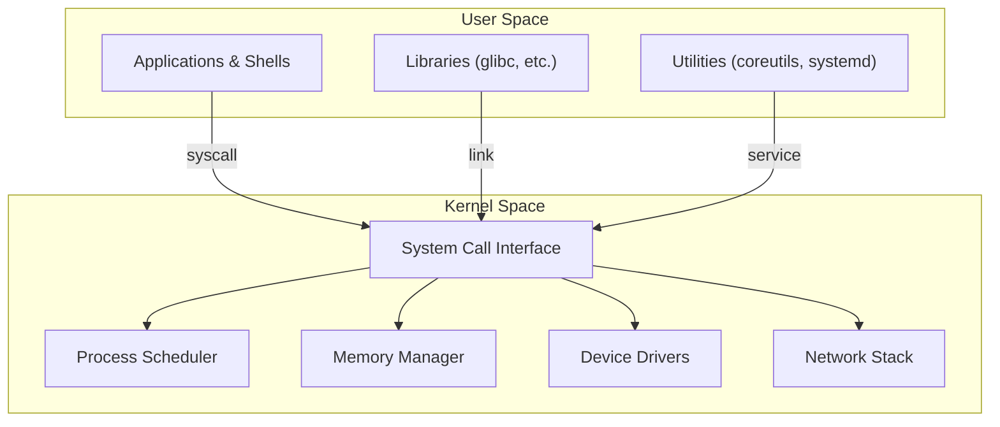
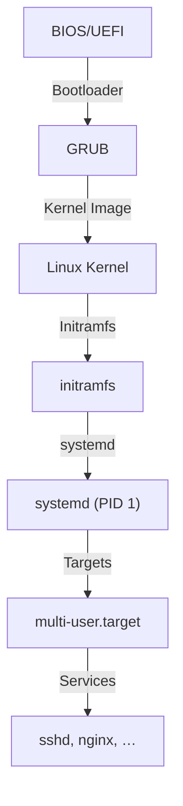
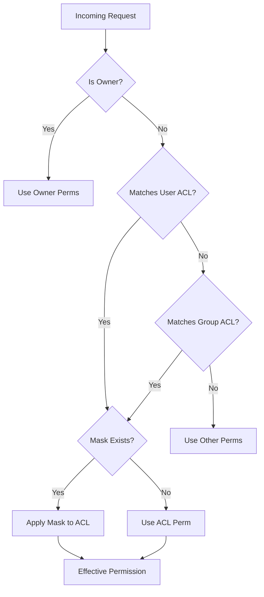
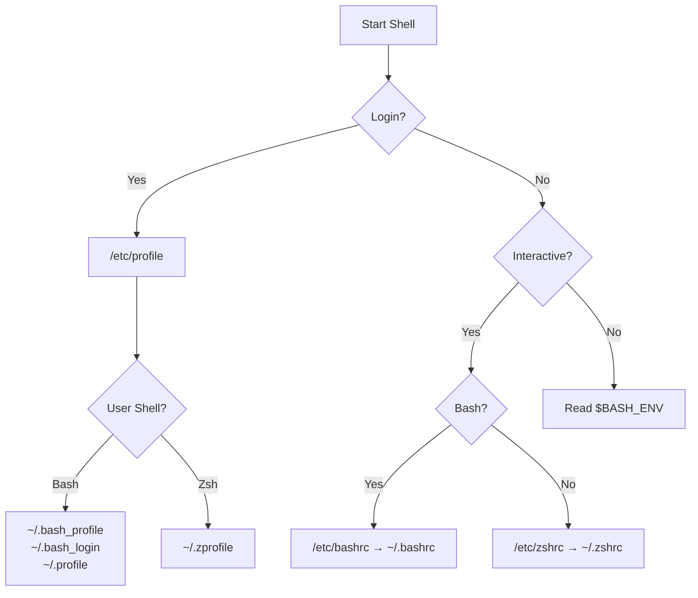
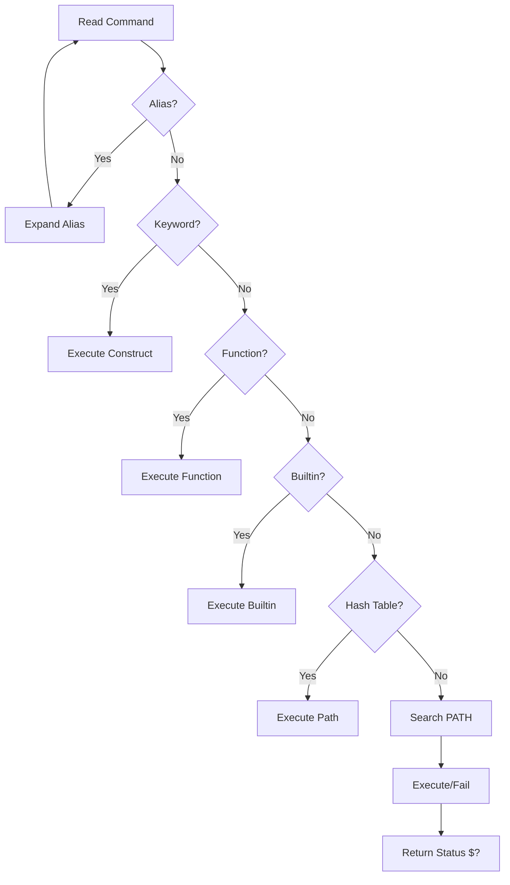
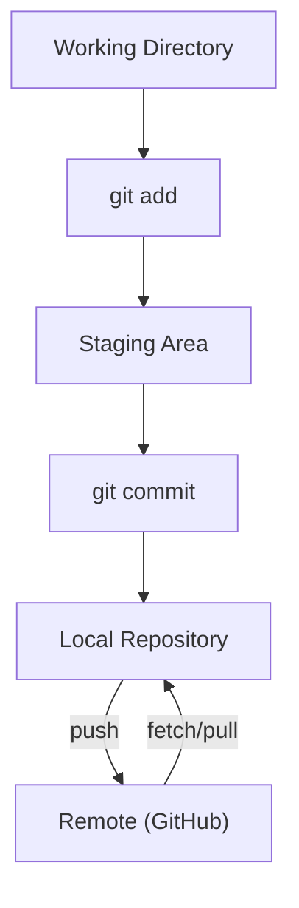
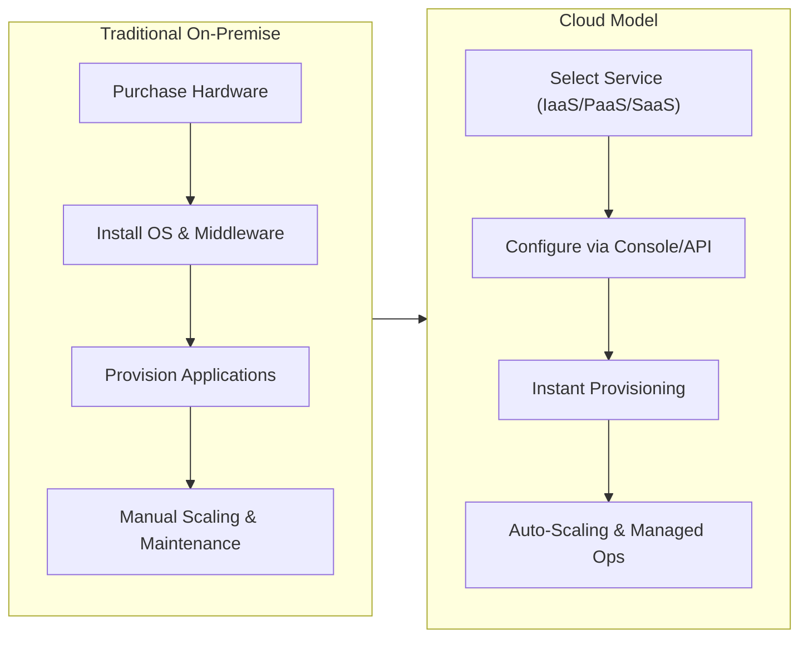
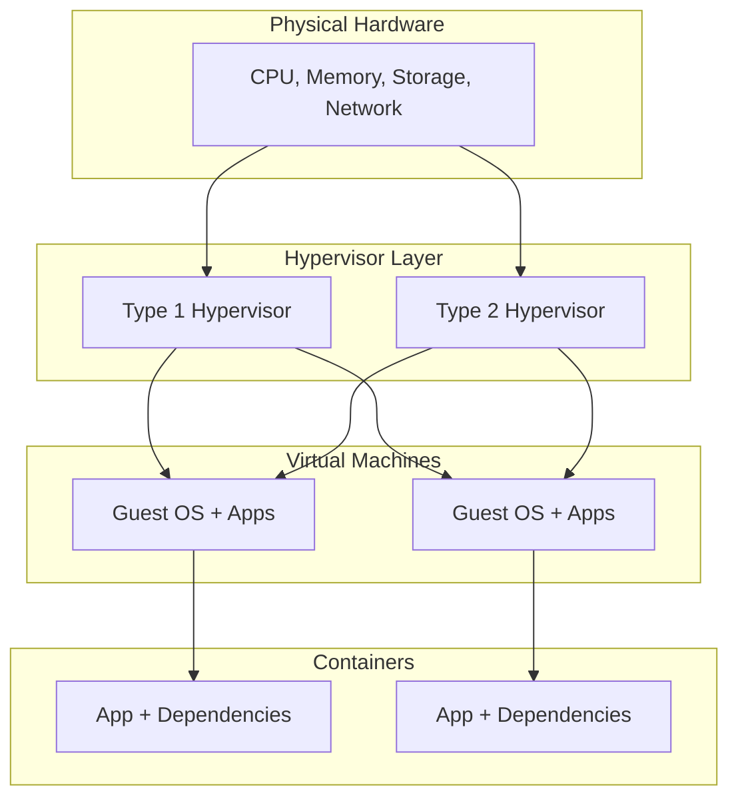

# Session 1 & 2 – Linux History and Operation

## 1. High‑level Session Overview
The first two sessions of the Linux module introduce the origins and evolution of the Linux operating system, the philosophical and legal foundations laid by the GNU project and the GPL, and the practical aspects of running Linux as a server.  We then dive into the internal architecture of Linux, distinguishing user‑space utilities from the kernel, and explore how these layers interact to provide a robust, modular platform.

---

## 2. Topic‑wise Explanation

### 2.1 The Evolution of Linux
- **Definition**: Linux is a Unix‑like, monolithic kernel originally created by Linus Torvalds in 1991, now the core of countless distributions.
- **Historical Context**: 
  - 1991: Linus releases version 0.01 on the internet.
  - 1992‑1994: Rapid adoption; merging with GNU utilities forms a complete OS.
  - 1998: Release of the 2.2 kernel, introducing SMP support.
  - 2000‑2020: Continuous development, LTS releases, rise of Android, cloud‑native containers.
- **Why It Matters Practically**: Understanding the timeline helps explain why Linux is modular, community‑driven, and why legacy compatibility (e.g., syscalls) remains important for server stability.

### 2.2 The GNU Movement and the GPL
- **Definition**: The GNU Project, started by Richard Stallman in 1983, aims to create a complete free software system; the GNU General Public License (GPL) is a copyleft license that ensures freedom to run, study, modify, and redistribute software.
- **Historical Context**:
  - 1983: GNU announced.
  - 1985‑1991: Development of core utilities (coreutils, bash, gcc).
  - 1991: GPL v2 adopted for the Linux kernel.
  - 2007: GPL v3 released, addressing patent‑trolling and hardware restrictions.
- **Why It Matters Practically**: The GPL’s copyleft nature influences how companies package and distribute Linux‑based products, and it shapes licensing decisions for open‑source contributions.

### 2.3 Linux Operations as a Server
- **Definition**: Deploying Linux to provide network services (web, database, file, etc.) with reliability, security, and scalability.
- **Historical Context**:
  - Early 1990s: Linux replaces Unix in many academic and research servers.
  - Late 1990s‑2000s: LAMP stack popularizes Linux for web hosting.
  - 2010‑present: Containerization (Docker, Kubernetes) and cloud‑native workloads run almost exclusively on Linux.
- **Why It Matters Practically**: Server‑grade Linux offers predictable performance, fine‑grained control over resources, and a vast ecosystem of tools for automation and monitoring.

### 2.4 The Architecture and Structure of Linux
- **Definition**: Linux’s architecture consists of the kernel (core OS services) and user space (applications, libraries, utilities) that communicate via system calls.
- **Historical Context**:
  - 1991: Monolithic kernel design chosen for performance.
  - 2001: Introduction of the `systemd` init system, reshaping user‑space service management.
  - 2015‑present: eBPF and modular kernel extensions expand functionality without recompiling the kernel.
- **Why It Matters Practically**: Knowing the separation helps troubleshoot performance issues, design secure services, and understand the impact of kernel updates on user‑space applications.

---

## 3. Linux Architecture Explanation (User Space vs Kernel Space)
- **Kernel Space**: Executes with highest privileges, manages memory, process scheduling, device drivers, networking stack, and system calls. It is a single address space shared by all kernel code.
- **User Space**: Runs applications, shells, and utilities. Each process has its own virtual address space, isolated from the kernel. Interaction occurs via system calls (e.g., `open`, `read`, `write`).
- **Interaction Flow**:
  1. An application in user space invokes a system call.
  2. Control transfers to the kernel via a software interrupt.
  3. The kernel validates parameters, performs the requested operation, and returns a result.
  4. The application resumes execution with the returned data.
- **Benefits**: Isolation protects the system from crashes in user programs; modularity allows independent development of utilities and drivers.

---

## 4. Diagram of Linux Architecture



- **Explanation of Diagram**:
  - **User Space** contains your running applications (web browsers, shells, scripts). They cannot access hardware directly.
  - **Kernel Space** is the protected core.
  - **System Calls (syscalls)** are the bridge: when an app needs to read a file or send a network packet, it asks the kernel via a syscall.


---

## 5. MCQ EDGE CASES
- **GPL Misconceptions**: *“GPL forces all software on a system to be GPL.”* – Incorrect; the copyleft applies only to derivative works, not unrelated binaries.
- **Kernel vs OS Confusion**: *“The kernel is the entire operating system.”* – The kernel is the core; the OS also includes user‑space tools, libraries, and init system.
- **Server vs Desktop Linux Traps**: *“Any Linux distro works equally well as a production server.”* – Desktop‑oriented distros may lack long‑term support, hardened defaults, or minimal footprints required for servers.

---

## 6. Ten MCQs (Easy → Tricky)
1. **Which year was the first Linux kernel released?**
   - A) 1989
   - B) 1991 *(Correct)*
   - C) 1993
   - D) 1995
2. **Who started the GNU Project?**
   - A) Linus Torvalds
   - B) Richard Stallman *(Correct)*
   - C) Brian Kernighan
   - D) Ken Thompson
3. **What does GPL stand for?**
   - A) General Public License *(Correct)*
   - B) GNU Public License
   - C) Global Permission License
   - D) Generic Programming License
4. **Which component runs in kernel space?**
   - A) Bash shell
   - B) systemd‑service manager *(Correct)*
   - C) Vim editor
   - D) Apache web server
5. **Which system call is used to create a new process?**
   - A) `fork()` *(Correct)*
   - B) `exec()`
   - C) `clone()`
   - D) `spawn()`
6. **What is the primary advantage of a monolithic kernel?**
   - A) Better modularity
   - B) Faster system‑call performance *(Correct)*
   - C) Easier debugging
   - D) Lower memory usage
7. **Which Linux distribution is officially LTS for 10 years?**
   - A) Fedora
   - B) Ubuntu
   - C) Debian *(Correct)*
   - D) Arch Linux
8. **Under GPL‑v2, if you link a proprietary application with a GPL‑licensed library, the resulting binary must be:**
   - A) Released under GPL‑v2 *(Correct)*
   - B) Remain proprietary
   - C) Released under MIT
   - D) No restriction applies
9. **eBPF in modern kernels is primarily used for:**
   - A) Replacing the scheduler
   - B) Extending kernel functionality without recompilation *(Correct)*
   - C) Managing user‑space memory
   - D) Bootloader operations
10. **Which of the following is a common pitfall when using a desktop‑oriented Linux distro on a production server?**
    - A) Lack of systemd
    - B) Presence of unnecessary GUI packages consuming resources *(Correct)*
    - C) Absence of kernel modules
    - D) Incompatible file system support

---

## 7. Short‑Answer Exam Questions
1. **Explain how the GPL copyleft mechanism influences commercial use of Linux‑based software.**
2. **Describe the sequence of events when a user‑space program performs a `read()` system call.**
3. **Identify three reasons why Linux is preferred for server deployments over proprietary operating systems.**

---

## 8. Common Student Mistakes
- Assuming the GPL forces *all* software on a machine to be GPL‑licensed.
- Confusing the kernel with the whole operating system; forgetting the role of init systems and user‑space utilities.
- Selecting a desktop‑focused distribution for a production server without stripping unnecessary packages, leading to larger attack surface and wasted resources.
- Overlooking the importance of LTS releases for stability in server environments.

---

## 9. References
- **Books**: 
  - *Linux Kernel Development* – Robert Love (3rd ed.)
  - *Understanding the Linux Kernel* – Daniel P. Bovet & Marco Cesati
  - *Free Software, Free Society* – Richard Stallman
- **Official Documentation**:
  - The Linux Kernel Archives – https://www.kernel.org
  - GNU Project – https://www.gnu.org
  - GPL FAQ – https://www.gnu.org/licenses/gpl-faq.html
  - systemd Documentation – https://www.freedesktop.org/wiki/Software/systemd/

---

# Installing & Configuring Linux (Ubuntu & CentOS) – Exam & Lab Notes

## 1. Installation Concepts (Theory Only)
- **Installation Media Types**: ISO images (DVD/USB), netboot (PXE), minimal bootstrappers (Ubuntu Server netboot, CentOS Kickstart), cloud images (QCOW2, VMDK). No command‑line examples are required – focus on the purpose of each media.
- **Custom Linux Server Installation**: 
  1. Choose a minimal ISO (no GUI). 
  2. Partition scheme – `/` (root), `swap`, `/var` (logs), `/home` (optional). 
  3. Select package groups: *core*, *networking*, *security* (SELinux/AppArmor), *monitoring*.
  4. Configure network (static IP, DNS) during installer.
  5. Set up a non‑root admin user and enable SSH.
  6. Post‑install: update package index, install essential tools (vim, curl, net-tools), enable firewall (ufw/ firewalld).
- **Why It Matters**: Understanding media and custom steps ensures a hardened, lean server footprint – essential for exam questions on security and performance.

## 2. Ubuntu vs CentOS Differences (Table)
| Feature | Ubuntu Server | CentOS (Stream) |
|---------|---------------|-----------------|
| Base Distribution | Debian‑derived (APT) | Red Hat‑derived (YUM/DNF) |
| Release Model | LTS every 2 years (5‑yr support) | Rolling‑release (continuous updates) |
| Default Init System | `systemd` | `systemd` |
| Package Manager | `apt` (`dpkg`) | `dnf` (`yum`) |
| SELinux | AppArmor (default) | SELinux (enforcing by default) |
| Kernel | Ubuntu‑kernel (generic) | RHEL kernel (stable) |
| Cloud Images | `cloud‑init` pre‑configured | `cloud‑init` with `cloud-utils` |
| Community Support | Large Ubuntu forums, Ask Ubuntu | CentOS forums, Red Hat knowledge base |

## 3. Runlevels vs systemd Targets (MCQ‑Focused)
- **Runlevels (SysV)**: 0‑halt, 1‑single‑user, 2‑multi‑user (no NFS), 3‑multi‑user, 4‑unused, 5‑graphical, 6‑reboot.
- **systemd Targets**: `poweroff.target`, `rescue.target`, `multi-user.target`, `graphical.target`, `reboot.target`.
- **Mapping Example**: Runlevel 3 ≈ `multi-user.target`; Runlevel 5 ≈ `graphical.target`.
- **Exam Tip**: MCQs often ask which target replaces runlevel 3 – answer: `multi-user.target`.

## 4. Login/Logout Workflow Internally
1. **Login**: `getty` reads username → `login` authenticates (PAM) → `sshd` (remote) creates a session → user’s shell is started → `systemd` creates a user slice.
2. **Logout**: Shell exits → `systemd` cleans up user slice → `pam_unix` logs session termination → `auditd` records event.
- **Why It Matters**: Knowing the sequence helps answer questions on PAM modules, session tracking, and security logs.

## 5. COMMAND SECTION

### `ls`

- **Syntax**: `ls [options] [path]`

- **Common Flags**: `-l` (long listing), `-a` (show hidden files)

- **Sample Output**:
```
-rw-r--r-- 1 user user  1024 Jan 10 12:00 file.txt
drwxr-xr-x 2 user user  4096 Jan 11 08:30 docs
```

- **Explanation of Output**:
  - `-rw-r--r--`: Permissions (read/write for owner, read-only for others).
  - `user user`: Owner and Group.
  - `1024`: File size in bytes.
  - `Jan 10 12:00`: Last modification time.
  - `file.txt`: File name.

- **MCQ Trap**: Confusing `-a` (all) with `-A` (all except `.` and `..`).

### `cp`

- **Syntax**: `cp [options] source destination`

- **Common Flags**: `-r` (recursive), `-p` (preserve attributes)

- **Sample Output**: *(no output on success; error on failure)*
```
cp: cannot stat 'nonexistent': No such file or directory
```

- **Explanation of Output**:
  - `cannot stat`: The system could not find file information.
  - `No such file or directory`: The source file does not exist.

- **MCQ Trap**: Assuming `cp -r` copies symlinks as files; actually copies the link target unless `-d` is used.

### `mv`

- **Syntax**: `mv [options] source destination`

- **Common Flags**: `-i` (interactive), `-f` (force)

- **Sample Output**: *(silent on success)*
```
mv: rename old.txt to new.txt: Permission denied
```

- **Explanation of Output**:
  - `Permission denied`: The user does not have write permission on the directory to move/rename the file.

- **MCQ Trap**: Believing `mv` creates a copy; it moves in‑place (same inode) when on same filesystem.

### `grep`

- **Syntax**: `grep [options] pattern [file...]`

- **Common Flags**: `-i` (ignore case), `-r` (recursive)

- **Sample Output**:
```
line 42:   error: failed to start service
```

- **Explanation of Output**:
  - `line 42`: Text from the file matching the pattern.
  - `error`: The pattern that was searched for.
  - The command acts as a filter, showing only lines that contain the match.

- **MCQ Trap**: Mixing up `-E` (extended regex) with `-F` (fixed‑string).

### `find`

- **Syntax**: `find [path...] [expression]`

- **Common Flags**: `-name` (match name), `-type` (file type)

- **Sample Output**:
```
./logs/error.log
./tmp/report.txt
```

- **Explanation of Output**:
  - Lists the relative paths of all files matching the criteria (e.g., name ending in `.log` or `.txt`) found within the current directory structure.

- **MCQ Trap**: Forgetting that `find` evaluates the whole expression left‑to‑right; ordering matters for performance.

### `tar`

- **Syntax**: `tar [options] [archive-file] [files...]`

- **Common Flags**: `-c` (create), `-x` (extract), `-z` (gzip), `-v` (verbose)

- **Sample Output** (verbose extract):
```
file1.txt
dir/file2.conf
```

- **Explanation of Output**:
  - Displays each file as it is being extracted from the archive because the `-v` (verbose) flag was used.

- **MCQ Trap**: Assuming `tar -czf` creates a *zip* file; it creates a gzipped tarball (`.tar.gz`).

### `ln`

- **Syntax**: `ln [options] target linkname`

- **Common Flags**: `-s` (symbolic), `-f` (force)

- **Sample Output**: *(none on success)*
```
ln: failed to create symbolic link ‘link’: File exists
```

- **Explanation of Output**:
  - Error message indicating that a file named `link` already exists, so `ln` cannot create a new link with that name unless `-f` (force) is used.

- **MCQ Trap**: Confusing hard links (`ln`) with symbolic links (`ln -s`). Hard links cannot span filesystems.

### `ps`

- **Syntax**: `ps [options]`

- **Common Flags**: `-e` (all processes), `-f` (full‑format)

- **Sample Output**:
```
UID   PID  PPID  C STIME TTY          TIME CMD
root     1     0  0 Jan01 ?        00:00:02 /sbin/init
user   1234  567  0 09:15 pts/0    00:00:00 bash
```

- **Explanation of Output**:
  - `UID`: User ID of the process owner.
  - `PID`: Process ID (unique identifier).
  - `PPID`: Parent Process ID (who started this process).
  - `CMD`: The command that launched the process.

- **MCQ Trap**: Assuming `ps aux` works on all UNIXes; on some systems `ps -ef` is the portable equivalent.

### `kill`

- **Syntax**: `kill [options] <pid>...`

- **Common Flags**: `-9` (SIGKILL), `-15` (SIGTERM)

- **Sample Output**: *(no output on success)*
```
kill: (1234) - No such process
```

- **Explanation of Output**:
  - `No such process`: There is no running process with PID 1234, so the signal could not be sent.

- **MCQ Trap**: Believing `kill -9` gracefully terminates a process; it forces immediate termination, bypassing cleanup.

## 6. LAB MAPPING – Single‑Command Creation of 100 Files
**Goal**: Demonstrate how to generate 100 empty files named `file001.txt` … `file100.txt` in one line.

**Method 1: Brace Expansion (Simplest & Best for Exam)**
```bash
touch file{001..100}.txt
```
**Explanation**:
- `{001..100}`: Automatically creates a sequence of numbers from 001 to 100 zero-padded.
- `touch`: Creates files for every item in the expanded list.

**Method 2: Using `seq` and `xargs` (Universal/Scripting approach)**
```bash
seq -w 1 100 | xargs -I{} touch file{}.txt
```
**Explanation**:
- `seq -w 1 100`: Generates numbers `001` to `100`.
- `xargs -I{}`: Takes each number and passes it to the `touch` command command.

## 7. Fifteen MCQs (≥5 Command‑Output Based)
1. Which flag makes `ls` show hidden files? **A) `-a`**
2. What does `cp -p` preserve? **B) Permissions, timestamps, and ownership**
3. After `mv file1 file2`, which inode number changes? **C) It stays the same if on the same filesystem**
4. `grep -i "error" logfile` will match **D) `Error`, `ERROR`, `error`**
5. In `find . -type f -name "*.log"`, the `-type f` option restricts results to **E) Regular files**
6. Which command extracts a gzipped tarball? **F) `tar -xzf archive.tar.gz`**
7. `ln -s target link` creates a **G) Symbolic link**
8. `ps -e` lists **H) All processes**
9. Sending `kill -9 1234` results in which signal? **I) SIGKILL**
10. Which init system does modern Ubuntu use? **J) `systemd`**
11. In a Kickstart file, the directive `network --bootproto=static` configures what? **K) A static IP address**
12. SELinux in enforcing mode will **L) Block disallowed actions and log them**
13. The `cloud‑init` package is primarily used for **M) Initial cloud instance configuration**
14. Which target replaces the old runlevel 5? **N) `graphical.target`**
15. The command `seq -w 1 3` outputs which of the following? **O) `001\n002\n003`**

## 8. Diagram – Linux Boot Process


- **Explanation of Boot Flow**:
  1. **BIOS/UEFI**: Initializes hardware and loads the bootloader.
  2. **GRUB**: The bootloader that loads the Linux Kernel into memory.
  3. **Kernel**: Detects hardware and mounts the temporary root filesystem (`initramfs`).
  4. **initramfs**: Loads necessary drivers to mount the real root filesystem.
  5. **systemd**: The first process (PID 1) that starts all other services.
  6. **Targets**: `systemd` reaches a target (like `multi-user.target`), which triggers services like `sshd` or web servers.


## 9. References (Man Pages)
- `man 5 bootloader` – GRUB configuration
- `man 8 systemd` – systemd and targets
- `man 1 ls`
- `man 1 cp`
- `man 1 mv`
- `man 1 grep`
- `man 1 find`
- `man 1 tar`
- `man 1 ln`
- `man 1 ps`
- `man 1 kill`
- `man 8 apt` / `man 8 dnf`
- `man 5 kickstart`
- `man 8 cloud-init`
- `man 8 selinux`

---

*End of notes.*

# Session 3 – Gaining Confidence with Linux

## 1. Permissions Model (User/Group/Other + Octal)
- **u/g/o**: three classes – **user** (owner), **group**, **others**. Each class has three bits: **r** (read = 4), **w** (write = 2), **x** (execute = 1).
- **Octal notation**: combine bits per class → three‑digit octal number (e.g., `0754`).
  - First digit: special bits – setuid (4), setgid (2), sticky (1).
  - Example: `chmod 2755 file` → setgid + `rwxr-xr-x`.
- **Effective permission evaluation**: check ACL first (if present), otherwise fall back to traditional bits.

## 2. ACL vs Traditional Permissions (Very Important)
- **Traditional**: only one owner, one group, and a single permission set for others.
- **ACL (Access Control List)**: allows multiple users/groups with distinct permissions.
- **Commands**:
  - `getfacl <file>` – display current ACL entries.
  - `setfacl -m u:alice:rwx <file>` – grant `alice` rwx.
  - `setfacl -x g:devs <file>` – remove group entry.
- **Evaluation order**:
  1. If a **mask** is present, it limits the maximum permissions for named users/groups.
  2. Specific ACL entries are checked before the generic `other` bits.
- **When to use**: shared directories where many users need different rights without changing ownership.

## 3. SSH vs FTP vs Telnet (Security MCQs)
| Protocol | Port | Encryption | Authentication | Typical Use | Security Rating |
|----------|------|------------|----------------|-------------|-----------------|
| Telnet   | 23   | None       | Username/Password (plain) | Legacy remote shell | ❌ (clear‑text) |
| FTP      | 21   | None (plain) | Username/Password (plain) | File transfer (legacy) | ❌ (clear‑text) |
| SFTP (SSH‑File) | 22 | SSH tunnel (AES) | Public‑key or password (encrypted) | Secure file transfer | ✅ |
| SSH      | 22   | SSH tunnel (AES) | Public‑key or password (encrypted) | Secure remote shell | ✅ |

**MCQ Example**: Which protocol encrypts both command and data channels? **Answer: SSH / SFTP**.

## 4. vi/vim Editor
### 4.1 Modes Table
| Mode | Entry Command | Description |
|------|---------------|-------------|
| Normal | `Esc` (or start) | Navigate, delete, copy, paste, execute commands. |
| Insert | `i`, `a`, `o` | Insert text at cursor or new line. |
| Visual | `v`, `V`, `Ctrl‑v` | Select text for operations (char, line, block). |
| Command‑line | `:` | Enter ex‑commands (e.g., `:wq`). |
| Replace | `R` | Overwrite existing text. |

### 4.2 Ten Essential Commands
1. `i` – enter Insert mode before cursor.
2. `a` – Insert after cursor.
3. `Esc` – return to Normal mode.
4. `:w` – write (save) file.
5. `:q` – quit.
6. `:wq` or `ZZ` – save and quit.
7. `dd` – delete current line.
8. `yy` – yank (copy) line.
9. `p` – paste after cursor.
10. `/pattern` – search forward; `n` to repeat.

### 4.3 Find/Replace & Cut/Copy/Paste
- Find/replace: `:%s/old/new/g` (global), `:%s/old/new/gc` (confirm).
- Cut line: `dd`; cut block: visual mode `v` then `d`.
- Copy line: `yy`; copy block: visual mode `v` then `y`.
- Paste: `p` (after) or `P` (before).

### 4.4 `set` Command in vi
- Change editor options: `:set number` (show line numbers), `:set nu!` (toggle), `:set paste` (disable auto‑indent), `:set ic` (ignore case in search), `:set hlsearch` (highlight matches).

## 5. LAB TASK – Solve the `/tmp/acl_file` Problem (Step‑by‑Step)
Assume the task: *Give user `bob` read/write access while keeping the owner’s rights, without changing the file’s group.*
1. Create the file (if missing): `touch /tmp/acl_file`.
2. Check current permissions: `ls -l /tmp/acl_file` and `getfacl /tmp/acl_file`.
3. Add ACL for bob: `setfacl -m u:bob:rw /tmp/acl_file`.
4. Verify: `getfacl /tmp/acl_file` should show `user:bob:rw-`.
5. (Optional) Set a mask to limit named users: `setfacl -m m::rw /tmp/acl_file`.
6. Test as bob: `su - bob`; `cat /tmp/acl_file` and `echo test >> /tmp/acl_file`.
7. Cleanup (if needed): `setfacl -x u:bob /tmp/acl_file`.

## 6. Twelve MCQs (Permissions + vi Heavy)
1. What octal value represents `rwxr-x---`? **A) 750**
2. Which command adds a read ACL for user `alice`? **B) `setfacl -m u:alice:r file`**
3. If a mask is `r-x`, what is the effective permission for a user entry `rw-`? **C) `r-x`**
4. Which bit is set by `chmod 2000 file`? **D) Sticky bit**
5. In vi, which command deletes the current line? **E) `dd`**
6. How do you start a global search‑replace for `foo` to `bar`? **F) `:%s/foo/bar/g`**
7. Which mode allows selection of a rectangular block? **G) Visual block mode (`Ctrl‑v`)**
8. What does `:set nu` do? **H) Shows line numbers**
9. After `setfacl -m u:bob:rw file`, which permission is *not* granted to `bob`? **I) Execute**
10. Which command writes and quits without prompting? **J) `:wq` or `ZZ`**
11. Which setting disables auto‑indent when pasting? **K) `:set paste`**
12. If a file has mode `0644` and an ACL entry `user:carol:rw-`, what is Carol’s effective permission? **L) `rw-`**

## 7. Five Trick Questions Students Usually Get Wrong
1. **Sticky bit on a regular file** – it has *no effect*; only directories use it to restrict deletion.
2. **Mask vs. other permissions** – the mask does *not* apply to the owner; it only limits named users/groups.
3. **`chmod 777` vs. ACL** – setting full bits does *not* remove existing ACL entries; they still apply.
4. **`set` vs. `:set` in vi** – `set` without a colon works only in Ex mode; in normal editing you must prefix with `:`.
5. **`ssh` vs. `sftp` security** – both use the same SSH encryption; the difference is the subsystem (shell vs. file transfer).


## 8. Diagram – Permission Evaluation Order



- **Explanation of Diagram**:
  - The system checks permissions in specific order: **Owner** first, then **Named Users (ACLs)**, then **Group** (including named groups), and finally **Others**.
  - **Masking**: If an ACL mask is present, it acts as a ceiling. Even if an ACL grants `rwx`, if the mask is `r--`, the effective permission is only `r--`.

## 9. References
- `man 1 chmod`
- `man 1 chown`
- `man 1 chgrp`
- `man 5 acl`
- `man 1 getfacl`
- `man 1 setfacl`
- `man 1 ssh`
- `man 1 sftp`
- `man 1 telnet`
- `man 1 ftp`
- `man 8 mount`
- `man 8 umount`
- `man 1 vi`
- `man 1 vim`

---

## 10. chmod, chown, chgrp (Basic Permission Commands)

### Syntax & Common Flags
- `chmod [options] mode file` – change file mode bits.
  - Common flags: `-R` (recursive), `-v` (verbose).
- `chown [options] owner[:group] file` – change file owner and optionally group.
  - Common flags: `-R` (recursive), `-c` (report changes).
- `chgrp [options] group file` – change group ownership.
  - Common flags: `-R` (recursive), `-v` (verbose).


### Sample Output
```
$ chmod 750 script.sh
$ ls -l script.sh
-rwxr-x--- 1 root root 1234 Jan 10 12:00 script.sh
$ chown alice:staff report.txt
$ ls -l report.txt
-rw-r--r-- 1 alice staff 5678 Jan 11 08:30 report.txt
```

- **Explanation of Output**:
  - `chmod 750`: Sets permissions to `rwxr-x---` (User: read/write/exec, Group: read/exec, Others: none).
  - `chown alice:staff`: Changes file owner to user `alice` and group to `staff`.


### MCQ Trap
Assuming `chmod 777` makes a file “secure” – it actually gives **everyone** full access.

## 11. mount & umount Basics

### Syntax & Common Options
- `mount <device> <mount-point>` – attach a filesystem.
  - Options: `-t <type>` (filesystem type), `-o ro,noexec` (read‑only, no‑exec).
- `umount <mount-point>` – detach a filesystem.
  - Option: `-l` (lazy unmount).


### Sample Output
```
$ sudo mount /dev/sdb1 /mnt/usb
$ df -h /mnt/usb
Filesystem      Size  Used Avail Use% Mounted on
/dev/sdb1       7.5G  2.1G  5.4G  28% /mnt/usb
$ sudo umount /mnt/usb
```

- **Explanation of Output**:
  - `mount`: Attaches the device `/dev/sdb1` to the directory `/mnt/usb`.
  - `df -h`: Shows disk usage in "human-readable" format (GB/MB).
  - `/dev/sdb1`: The filesystem partition being used.
  - `28%`: Percentage of space currently used on that partition.


### MCQ Trap
Confusing `umount` with `unmount` – the correct command is **`umount`** (no “n”).

## 12. ACL Example Workflow (Expanded)

1. Create a file: `touch project.txt`.
2. Set a basic ACL for user *bob*: `setfacl -m u:bob:rw project.txt`.
3. Verify with `getfacl project.txt` – you should see an entry `user:bob:rw-`.
4. (Optional) Restrict named users with a mask: `setfacl -m m::rw project.txt`.
5. Remove the ACL when no longer needed: `setfacl -x u:bob project.txt`.

## 13. Expanded `:set` Options in vi

| Option | Description |
|--------|-------------|
| `number` / `nu` | Show line numbers. |
| `relativenumber` / `rnu` | Show relative line numbers. |
| `ignorecase` / `ic` | Case‑insensitive search. |
| `hlsearch` / `hls` | Highlight all matches. |
| `incsearch` / `is` | Incremental search feedback. |
| `paste` | Disable auto‑indent when pasting. |
| `tabstop=4` | Set width of a hard tab. |
| `expandtab` | Convert tabs to spaces. |
| `autoindent` / `ai` | Preserve indentation of previous line. |
| `smartindent` / `si` | Smart auto‑indent for C‑like languages. |

## 14. Additional MCQs (Permissions & Mount)

1. Which octal mode gives **read/write** for owner and **read‑only** for group and others? **A) 644**
2. `chown root:wheel file` changes **owner** to **root** and **group** to **wheel**. (True/False) **True**
3. To mount a filesystem read‑only, which option is used? **B) `-o ro`**

## 15. References (Updated)

- `man 1 chmod`
- `man 1 chown`
- `man 1 chgrp`
- `man 1 getfacl`
- `man 1 setfacl`
- `man 1 ssh`
- `man 1 sftp`
- `man 1 telnet`
- `man 1 ftp`
- `man 8 mount`
- `man 8 umount`
- `man 1 vi`
- `man 1 vim`

---

## Session 4,5,6 – Linux Shell Programming

### 1. Shell Lifecycle & Startup File Order

A **login shell** reads `/etc/profile`, then the first of `~/.bash_profile`, `~/.bash_login`, or `~/.profile` (Bash) / `~/.zprofile` (Zsh). An **interactive non‑login shell** reads `/etc/bashrc` and `~/.bashrc` (Bash) / `~/.zshrc` (Zsh). A **non‑interactive shell** reads the file specified by the `BASH_ENV` environment variable.

> **Reference:** `man bash` – *INVOCATION* section.




### 3. Variable Scope & Expansion Pitfalls
- **Shell variables** are local to the current shell instance. Use `export VAR=value` to promote to **environment variables** inherited by child processes. [!NOTE] `export` does not affect the parent shell.
- **Unquoted expansion** can cause word‑splitting and globbing. Example: `files=$(ls *.txt)` – if any filename contains spaces, it will be split incorrectly. [!WARNING] Always quote: `"$files"`.
- **`${var:-default}`** provides a default without assigning; `${var:=default}` assigns the default.
> **Reference:** `man bash` – *PARAMETER EXPANSION*.

### 4. Conditional Logic with `test` / `[ ]` / `[[ ]]`
| Construct | Syntax | Advantages |
|---|---|---|
| `test` / `[ ]` | `[ -f "$file" ]` | POSIX‑compatible, works in `sh`.
| `[[ ]]` (Bash/Zsh) | `[[ -f $file && $size -gt 0 ]]` | No word‑splitting, supports regex (`=~`).
| `(( ))` arithmetic | `(( i < 10 ))` | Direct arithmetic evaluation.
> **Reference:** `man bash` – *CONDITIONAL EXPRESSIONS*.

### 5. Loop Behavior Edge Cases
- **`for var in *`** – globbing occurs before the loop; if no match, the pattern is left unchanged (depends on `nullglob`).
- **`while read line; do …; done < file`** – `read` strips trailing newlines; use `IFS= read -r line` to preserve backslashes.
- **`select`** – generates a numbered menu; pressing *Enter* repeats the last selection.
> **Reference:** `man bash` – *LOOPS*.

### 6. Job Control Signals & Traps
| Symbol / Signal | Meaning |
|---|---|
| `&` | Run command in background.
| `Ctrl‑Z` | Sends `SIGTSTP` – stops the job.
| `bg %1` / `fg %1` | Resume stopped job in background/foreground.
| `trap 'cmd' SIGINT` | Execute `cmd` when `SIGINT` (Ctrl‑C) is received.
> **Reference:** `man bash` – *SHELL BUILTIN COMMANDS* (`trap`).

### 7. Built‑ins & Functions
- **Built‑ins**: `cd`, `echo`, `printf`, `read`, `pushd`, `popd`, `type`, `declare`, `set`, `shopt`.
- **Function definition**:
```bash
my_func() {
    local arg1="$1"
    echo "Argument is: $arg1"
}
```
Functions inherit the current shell’s environment; use `local` to avoid polluting the global namespace.
> **Reference:** `man bash` – *SHELL BUILTIN COMMANDS*.

### 8. Lab Tasks
#### 8.1 Change login shell to `nologin`
```bash
# Verify current shell
cat /etc/passwd | grep "$(whoami)"
# Change shell (requires root)
sudo chsh -s /usr/sbin/nologin $(whoami)
# Confirm change
getent passwd $(whoami)
```
> **Reference:** `man chsh`.

#### 8.2 ACL restriction to `user5`
```bash
# Ensure ACL utilities are installed
sudo apt-get install acl   # Debian/Ubuntu
# Create a test file
touch /tmp/acl_demo
# Grant read/write to user5 only
setfacl -m u:user5:rw /tmp/acl_demo
# Verify
getfacl /tmp/acl_demo
# Remove ACL later
setfacl -x u:user5 /tmp/acl_demo
```
> **Reference:** `man setfacl`, `man getfacl`.

### 9. 20 MCQs (8 + tricky)
1. Which option makes a variable **environmental** for child processes? **A) `export VAR`**
2. In Bash, which test returns true for a non‑empty string? **B) `[[ -n "$var" ]]`**
3. What does `set -o noclobber` prevent? **C) Overwriting existing files with `>`**
4. Which signal stops a job but keeps it in memory? **D) `SIGTSTP`**
5. Which built‑in prints arguments separated by spaces? **E) `echo`**
6. In Zsh, `setopt EXTENDED_GLOB` enables what? **F) Advanced glob patterns**
7. What is the exit status of a successful `[[ … ]]` test? **G) `0`**
8. Which command lists all defined shell functions? **H) `declare -F`**

### 2. Bash vs sh vs zsh (MCQ Table)
| Feature | Bash | sh (POSIX) | Zsh |
|---|---|---|---|
| Default on most Linux | ✅ | ❌ (link to `/bin/sh` often points to Bash) | ❌ |
| Array support | ✅ (`declare -a`) | ❌ | ✅ (`set -A`) |
| Extended globbing | ✅ (`shopt -s extglob`) | ❌ | ✅ (built‑in) |
| Prompt theming | ✅ (`PS1`) | ✅ (basic) | ✅ (`PROMPT`) |
| Job control | ✅ | ✅ | ✅ |
| **MCQ Example**: Which shell natively supports associative arrays? **Answer:** Bash (since 4.0) and Zsh; POSIX sh does not. |
> **Reference:** `man bash`, `man zsh`, `man sh`.

### 3. Variable Scope & Expansion Pitfalls
- **Shell variables** are local to the current shell instance. Use `export VAR=value` to promote to **environment variables** inherited by child processes. [!NOTE] `export` does not affect the parent shell.
- **Unquoted expansion** can cause word‑splitting and globbing. Example: `files=$(ls *.txt)` – if any filename contains spaces, it will be split incorrectly. [!WARNING] Always quote: `"$files"`.
- **`${var:-default}`** provides a default without assigning; `${var:=default}` assigns the default.
> **Reference:** `man bash` – *PARAMETER EXPANSION*.

### 4. Conditional Logic with `test` / `[ ]` / `[[ ]]`
| Construct | Syntax | Advantages |
|---|---|---|
| `test` / `[ ]` | `[ -f "$file" ]` | POSIX‑compatible, works in `sh`.
| `[[ ]]` (Bash/Zsh) | `[[ -f $file && $size -gt 0 ]]` | No word‑splitting, supports regex (`=~`).
| `(( ))` arithmetic | `(( i < 10 ))` | Direct arithmetic evaluation.
> **Reference:** `man bash` – *CONDITIONAL EXPRESSIONS*.

### 5. Loop Behavior Edge Cases
- **`for var in *`** – globbing occurs before the loop; if no match, the pattern is left unchanged (depends on `nullglob`).
- **`while read line; do …; done < file`** – `read` strips trailing newlines; use `IFS= read -r line` to preserve backslashes.
- **`select`** – generates a numbered menu; pressing *Enter* repeats the last selection.
> **Reference:** `man bash` – *LOOPS*.

### 6. Job Control Signals & Traps
| Symbol / Signal | Meaning |
|---|---|
| `&` | Run command in background.
| `Ctrl‑Z` | Sends `SIGTSTP` – stops the job.
| `bg %1` / `fg %1` | Resume stopped job in background/foreground.
| `trap 'cmd' SIGINT` | Execute `cmd` when `SIGINT` (Ctrl‑C) is received.
> **Reference:** `man bash` – *SHELL BUILTIN COMMANDS* (`trap`).

### 7. Built‑ins & Functions
- **Built‑ins**: `cd`, `echo`, `printf`, `read`, `pushd`, `popd`, `type`, `declare`, `set`, `shopt`.
- **Function definition**:
```bash
my_func() {
    local arg1="$1"
    echo "Argument is: $arg1"
}
```
Functions inherit the current shell’s environment; use `local` to avoid polluting the global namespace.
> **Reference:** `man bash` – *SHELL BUILTIN COMMANDS*.

### 8. Lab Tasks
#### 8.1 Change login shell to `nologin`
```bash
# Verify current shell
cat /etc/passwd | grep "$(whoami)"
# Change shell (requires root)
sudo chsh -s /usr/sbin/nologin $(whoami)
# Confirm change
getent passwd $(whoami)
```
> **Reference:** `man chsh`.

#### 8.2 ACL restriction to `user5`
```bash
# Ensure ACL utilities are installed
sudo apt-get install acl   # Debian/Ubuntu
# Create a test file
touch /tmp/acl_demo
# Grant read/write to user5 only
setfacl -m u:user5:rw /tmp/acl_demo
# Verify
getfacl /tmp/acl_demo
# Remove ACL later
setfacl -x u:user5 /tmp/acl_demo
```
> **Reference:** `man setfacl`, `man getfacl`.

### 9. 20 MCQs (8 + tricky)
1. Which option makes a variable **environmental** for child processes? **A) `export VAR`**
2. In Bash, which test returns true for a non‑empty string? **B) `[[ -n "$var" ]]`**
3. What does `set -o noclobber` prevent? **C) Overwriting existing files with `>`**
4. Which signal stops a job but keeps it in memory? **D) `SIGTSTP`**
5. Which built‑in prints arguments separated by spaces? **E) `echo`**
6. In Zsh, `setopt EXTENDED_GLOB` enables what? **F) Advanced glob patterns**
7. What is the exit status of a successful `[[ … ]]` test? **G) `0`**
8. Which command lists all defined shell functions? **H) `declare -F`**
9. **Tricky:** `[[ $a == $b ]]` performs what kind of comparison? **Answer:** Pattern‑matching, not strict string equality.
10. **Tricky:** Using `[` without quoting a variable that may be empty can cause what? **Answer:** Syntax error or unexpected behavior due to missing argument.
11. **Tricky:** `for i in {1..5}` works in Bash but not in POSIX `sh`. **Answer:** True.
12. **Tricky:** `read -r line` prevents backslash interpretation. **Answer:** True.
13. Which signal is sent by `kill -9`? **I) `SIGKILL`**
14. What does `shopt -s nullglob` change? **J) Unmatched globs expand to null string.**
15. Which construct creates an associative array in Bash? **K) `declare -A arr`**
16. What does `set -e` cause? **L) Exit on any command returning non‑zero.**
17. Which built‑in changes the current directory? **M) `cd`**
18. How to list all exported variables? **N) `export -p`**
19. Which command disables job control? **O) `set +m`**
20. What does `$?` hold after a pipeline? **P) Exit status of the **last** command in the pipeline (unless `pipefail` is set).**

### 10. Bash Pitfalls List
- **Quoting:** `echo $var` vs `echo "$var"` – unquoted may split on IFS.
- **`$?` after `&&`/`||`:** Only reflects the last command executed, not the whole chain.
- **`$@` vs `$*`:** `$@` expands to separate arguments; `$*` joins them into one word (respecting IFS).
- **Array indexing starts at 0.**
- **`[[ $a = $b ]]` uses pattern matching; use `==` for clarity.
- **`read` without `-r` interprets backslashes.**
> **Reference:** `man bash` – *EXPANSION* and *SHELL BUILTIN COMMANDS*.

### 11. Mermaid Diagram – Bash Execution Flow


### 12. References
- `man bash` – Bash Reference Manual.
- `man sh` – POSIX Shell.
- `man zsh` – Z Shell Manual.
- `man chsh` – Change login shell.
- `man setfacl`, `man getfacl` – ACL utilities.
- *The Linux Programming Interface* (Michael Kerrisk) – sections on process environment.
- *Advanced Bash‑Scripting Guide* – for pitfalls and best practices.
---

## Session 7 – Git / GitHub

### 1. Version Control Basics
- **Version control** tracks changes to files over time, enabling rollback, collaboration, and history inspection.
- **Centralized VCS** (e.g., Subversion): a single server holds the authoritative repository; clients check out and commit directly to it.
- **Distributed VCS** (e.g., Git): every clone contains the full repository history; commits are local and can be pushed to remotes.

### 2. Git vs GitHub
- **Git** is the DVCS engine (commands, data structures).
- **GitHub** is a hosted service that stores Git repositories and adds collaboration features (pull requests, issues, web UI).

### 3. Repository Creation
- **Local repository**: `git init` creates a `.git` directory.
- **Remote repository** (GitHub): create a new repo via the web UI, then add it as a remote:
  ```bash
  git remote add origin https://github.com/<username>/<repo>.git
  ```

### 4. Core Git Commands (with examples)
| Command | Example | Description |
|---|---|---|
| `git init` | `git init myproj` | Initialise a new repository.
| `git clone` | `git clone https://github.com/user/repo.git` | Copy a remote repo locally.
| `git add` | `git add README.md` | Stage changes for commit.
| `git commit` | `git commit -m "Add README"` | Record staged changes.
| `git push` | `git push origin main` | Upload local commits to remote.
| `git pull` | `git pull origin main` | Fetch and merge remote changes.
| `git status` | `git status` | Show working‑tree status.
| `git log` | `git log --oneline` | View commit history.
| `git branch` | `git branch feature-x` | List/create branches.
| `git checkout` | `git checkout feature-x` | Switch branches or restore files.
| `git merge` | `git merge feature-x` | Integrate a branch.
| `git fetch` | `git fetch origin` | Retrieve remote objects without merging.
| `git rebase` | `git rebase main` | Reapply commits on top of another base.

### 5. Git Workflow Diagram


### 6. Common MCQ Traps
- **Commit vs Push**: `git commit` records locally; `git push` sends to remote.
- **Clone vs Fork**: `clone` copies an existing repo; `fork` creates a new remote copy under your GitHub account.
- **Pull vs Fetch**: `pull` = `fetch` + `merge`; `fetch` only downloads.
- **Merge vs Rebase**: merge creates a merge commit; rebase rewrites history.

### 7. MCQs (10)
1. Which command creates a new empty Git repository? **A) `git init`**
2. To copy a remote repository to your machine, you use: **B) `git clone`**
3. After editing files, which command stages them for commit? **C) `git add`**
4. The command that records staged changes permanently is: **D) `git commit`**
5. To upload local commits to GitHub, you run: **E) `git push`**
6. Which operation fetches changes without merging? **F) `git fetch`**
7. A **fork** on GitHub creates: **G) a new remote repository under your account**
8. The difference between `git pull` and `git fetch` is that `pull` also: **H) merges the fetched changes**
9. Which command switches to an existing branch named `dev`? **I) `git checkout dev`**
10. To combine changes from branch `feature` into `main` you would typically use: **J) `git merge feature`**

### 8. Lab Mini‑Tasks
**Task 1 – Initialise and commit**
```bash
mkdir demo && cd demo
git init
echo "Hello Git" > hello.txt
git add hello.txt
git commit -m "Add hello.txt"
```
Verify with `git log`.

**Task 2 – Fork, clone, branch, push**
1. Fork a public repo on GitHub (e.g., `octocat/Hello-World`).
2. Clone your fork:
   ```bash
   git clone https://github.com/<your‑user>/Hello-World.git
   cd Hello-World
   ```
3. Create and switch to a new branch:
   ```bash
   git checkout -b experiment
   ```
4. Make a change, commit, and push:
   ```bash
   echo "Experiment" >> README.md
   git add README.md
   git commit -m "Add experiment note"
   git push origin experiment
   ```
Open a Pull Request on GitHub.

### 9. References
- Official Git Documentation: <https://git-scm.com/doc>
- GitHub Guides: <https://guides.github.com/>
- Pro Git (Scott Chacon & Ben Straub) – free online book.
---

## Session 8 – Introduction to Cloud Computing

### 1. Formal Definition (exam‑ready)
- **Cloud Computing**: A model for enabling ubiquitous, convenient, on‑demand network access to a shared pool of configurable computing resources (e.g., networks, servers, storage, applications, and services) that can be rapidly provisioned and released with minimal management effort or service provider interaction. *(NIST SP 800‑145)*

> **Expanded Explanation:** Cloud computing abstracts the underlying hardware, allowing users to focus on application logic. It supports on‑demand scaling, pay‑as‑you‑go pricing, and global accessibility. The model includes service models (IaaS, PaaS, SaaS) and deployment models (public, private, hybrid, community).

### 2. NIST Cloud Characteristics (gold‑standard MCQ material)

> **Explanation:** The NIST characteristics define the essential properties of cloud services. They are used by exam writers to craft questions about self‑service, network access, pooling, elasticity, and metering.
| # | Characteristic | Brief Explanation |
|---|----------------|-------------------|
| 1 | **On‑demand self‑service** | Users can provision resources automatically without human interaction. |
| 2 | **Broad network access** | Resources are available over the network and accessed through standard mechanisms (e.g., browsers, APIs). |
| 3 | **Resource pooling** | Provider’s resources serve multiple consumers using a multi‑tenant model. |
| 4 | **Rapid elasticity** | Capabilities can be elastically provisioned and released, scaling automatically. |
| 5 | **Measured service** | Resource usage is monitored, controlled, and reported for transparency. |

### 3. Major Cloud Vendors – Comparison Table

> **Vendor Overview:** Each provider offers a broad portfolio. AWS leads in breadth and maturity, Azure integrates tightly with Microsoft ecosystems, and GCP excels in data analytics and AI services.
| Feature | **AWS** | **Microsoft Azure** | **Google Cloud Platform (GCP)** |
|---|---|---|---|
| Compute | EC2, Lambda, ECS, EKS | Virtual Machines, Azure Functions, AKS | Compute Engine, Cloud Functions, GKE |
| Storage | S3, EBS, Glacier | Blob Storage, Disk Storage, Archive | Cloud Storage, Persistent Disks |
| Database | RDS, DynamoDB, Aurora | Azure SQL, Cosmos DB, PostgreSQL | Cloud SQL, Firestore, Bigtable |
| Networking | VPC, CloudFront, Route 53 | Virtual Network, CDN, DNS | VPC, Cloud CDN, Cloud DNS |
| Pricing Model | Pay‑as‑you‑go, Reserved, Spot | Pay‑as‑you‑go, Reserved, Spot | Pay‑as‑you‑go, Sustained Use, Preemptible |
| Free Tier | 12 months + always‑free limits | 12 months + always‑free limits | 12 months + always‑free limits |

### 4. Diagram – Traditional IT vs Cloud

> **Diagram Context:** The diagram contrasts the traditional on‑premise lifecycle (hardware purchase, manual provisioning, scaling) with the cloud model where resources are selected, configured, and auto‑scaled via APIs.


### 5. Common MCQ Traps (exam focus)

> **Trap Details:** These traps highlight common misconceptions that candidates often fall for; understanding the nuance helps avoid selecting wrong options.
- **Elasticity vs Scalability** – Elasticity is automatic, scalability may require manual configuration.
- **IaaS vs PaaS** – IaaS provides raw compute/storage; PaaS adds runtime/platform services.
- **Public vs Private Cloud** – Public is shared; private is dedicated to a single organization.
- **Pay‑as‑you‑go vs Reserved** – Reserved offers lower cost for committed usage; pay‑as‑you‑go is on‑demand.

### 6. MCQs (12)
1. Which NIST characteristic describes the ability to automatically provision and release resources? **A) On‑demand self‑service**
2. In a cloud model, the shared pool of resources is known as **B) Resource pooling**.
3. Which service model provides a complete development platform including OS, runtime, and middleware? **C) PaaS**.
4. Which vendor offers the **Lambda** serverless compute service? **A) AWS**.
5. The Google Cloud equivalent of AWS S3 is **B) Cloud Storage**.
6. Which characteristic ensures that resource usage is transparently measured for billing? **E) Measured service**.
7. A **private cloud** is best described as: **D) Cloud infrastructure operated solely for a single organization**.
8. Which Azure service is analogous to AWS EC2? **C) Virtual Machines**.
9. The term **elasticity** primarily refers to: **A) Automatic scaling of resources up or down**.
10. Which of the following is NOT a typical benefit of cloud computing? **D) Unlimited free resources**.
11. In GCP, **preemptible VMs** are similar to which AWS offering? **B) Spot Instances**.
12. Which diagram element represents **auto‑scaling** in the Cloud Model? **H) Auto‑Scaling & Managed Ops**.

### 7. References
- NIST SP 800‑145 – *The NIST Definition of Cloud Computing* (https://csrc.nist.gov/publications/detail/sp/800-145/final)

---

## Session 11 & 12 – Cloud Administration & Monitoring

### 1. Pricing Dimensions
| Dimension | What It Covers | Typical Metric | Example Provider Insight |
|---|---|---|---|
| **Compute** | vCPU, instance type, runtime hours | CPU‑hours, vCPU‑seconds | AWS EC2 on‑demand rate, Azure VM pay‑as‑you‑go |
| **Storage** | Block, object, file storage size & duration | GB‑month, IOPS | AWS S3 storage‑GB, Azure Blob storage‑GB |
| **Network** | Data transfer in/out, VPN, load‑balancer traffic | GB‑transfer, per‑request | AWS Data Transfer OUT, GCP Egress charges |
| **Additional** | Snapshots, API calls, support plans | per‑unit cost | AWS Snapshot per‑GB, Azure Monitor data ingestion |

### 2. Compute Services Overview
- **AWS EC2** – Scalable virtual servers with a wide range of instance families (general, compute‑optimized, memory‑optimized). Supports Spot, Reserved, and On‑Demand pricing.
- **Azure Virtual Machines** – Similar to EC2, offering Windows and Linux images, with Azure Spot and Reserved VM options.
- **Google Compute Engine** – Custom‑machine types, pre‑emptible VMs, and sustained‑use discounts.
- **Managed Container Services** – AWS Fargate, Azure Container Instances, GCP Cloud Run (serverless containers) – useful for micro‑services.

### 3. SaaS vs PaaS vs IaaS Comparison
| Layer | Definition | Managed By | Typical Example |
|---|---|---|---|
| **SaaS** | Fully functional application delivered over the internet. | Provider (software, runtime, OS, hardware) | Google Workspace, Microsoft 365, Salesforce |
| **PaaS** | Platform for building/deploying applications; includes runtime, middleware, OS. | Provider (runtime, OS, hardware) – user supplies code | Azure App Service, Google App Engine, Heroku |
| **IaaS** | Raw compute, storage, networking resources. | User (OS, middleware, apps) – provider supplies hardware & virtualization | AWS EC2, Azure Virtual Machines, GCP Compute Engine |

### 4. Monitoring Metrics (exam‑ready list)
- **CPU Utilisation** – % of allocated vCPU used.
- **Memory Utilisation** – % of RAM consumed.
- **Disk I/O** – Read/write ops per second, latency.
- **Network In/Out** – Throughput (Mbps) and packets.
- **Latency / Response Time** – End‑to‑end request latency.
- **Error Rates** – HTTP 4xx/5xx counts, service‑specific error codes.
- **Health Checks / Status** – Instance/Pod health, service availability.
- **Cost‑related metrics** – Spend per service, budget alerts.

### 5. Exam Traps in Pricing Questions
- **Reserved vs Spot** – Spot is cheap but can be terminated; reserved guarantees capacity.
- **Free‑Tier Misinterpretation** – Only limited usage; exceeding limits incurs charges.
- **Data‑Transfer Costs** – Inbound is often free; outbound to internet is billed.
- **Storage Class Mix‑up** – Different classes (Standard, Infrequent Access, Glacier) have distinct pricing.
- **Hidden Costs** – Snapshots, API requests, monitoring data ingestion can add up.

### 6. MCQs (10)
1. Which pricing model provides the lowest cost for workloads that can tolerate interruptions? **A) Spot Instances**
2. In AWS, data transferred **into** a region is generally **free**. **True**
3. The primary metric for scaling a web‑tier based on load is **CPU utilisation**. **True**
4. Azure Monitor charges **per GB of data ingested** for logs. **True**
5. A **reserved instance** guarantees a fixed hourly rate for a 1‑year term. **True**
6. GCP’s **Sustained‑Use Discount** applies automatically after 25% of a month’s usage. **True**
7. The **free tier** for AWS S3 includes unlimited storage. **False**
8. **Egress** traffic from a cloud provider to the public internet is typically billed. **True**
9. Snapshots of block storage are billed **per GB‑month** of snapshot size. **True**
10. Monitoring **CPU throttling** is a metric that indicates a VM is exceeding its allocated CPU credits. **True**

### 7. Lab Mini‑Scenarios
**Lab 1 – Cost‑budget alarm**
```bash
# AWS CLI example
aws budgets create-budget \
  --account-id $(aws sts get-caller-identity --query Account --output text) \
  --budget file://budget.json
# budget.json defines a $50 monthly limit and an SNS notification target
```
Verify the alarm triggers when spend exceeds the limit.

**Lab 2 – CPU utilisation alert**
1. Open the cloud provider’s monitoring console (e.g., CloudWatch, Azure Monitor, GCP Operations).
2. Create a metric‑based alarm on **CPUUtilization > 80%** for a 5‑minute period.
3. Set the alarm action to send an email/SNS notification.
4. Generate load (e.g., `stress --cpu 4`) and confirm the alarm fires.

### 8. References
- NIST SP 800‑145 – *The NIST Definition of Cloud Computing* (https://csrc.nist.gov/publications/detail/sp/800-145/final)
- AWS Billing and Cost Management User Guide (https://docs.aws.amazon.com/awsaccountbilling/latest/aboutv2/)
- Azure Monitor Documentation (https://learn.microsoft.com/azure/azure-monitor/)
- Google Cloud Operations Suite (formerly Stackdriver) (https://cloud.google.com/monitoring)
- *Cloud Computing: Concepts, Technology & Architecture* – Thomas Erl (ISBN 978‑0133387520)
---

### 1. Pricing Dimensions
| Dimension | What It Covers | Typical Metric | Example Provider Insight |
|---|---|---|---|
| **Compute** | vCPU, instance type, runtime hours | CPU‑hours, vCPU‑seconds | AWS EC2 on‑demand rate, Azure VM pay‑as‑you‑go |
| **Storage** | Block, object, file storage size & duration | GB‑month, IOPS | AWS S3 storage‑GB, Azure Blob storage‑GB |
| **Network** | Data transfer in/out, VPN, load‑balancer traffic | GB‑transfer, per‑request | AWS Data Transfer OUT, GCP Egress charges |
| **Additional** | Snapshots, API calls, support plans | per‑unit cost | AWS Snapshot per‑GB, Azure Monitor data ingestion |

### 2. Monitoring Metrics (exam‑ready list)
- **CPU Utilisation** – % of allocated vCPU used.
- **Memory Utilisation** – % of RAM consumed.
- **Disk I/O** – Read/write ops per second, latency.
- **Network In/Out** – Throughput (Mbps) and packets.
- **Latency / Response Time** – End‑to‑end request latency.
- **Error Rates** – HTTP 4xx/5xx counts, service‑specific error codes.
- **Health Checks / Status** – Instance/Pod health, service availability.
- **Cost‑related metrics** – Spend per service, budget alerts.

### 3. Exam Traps in Pricing Questions
- **Reserved vs Spot** – Spot is cheap but can be terminated; reserved guarantees capacity.
- **Free‑Tier Misinterpretation** – Only limited usage; exceeding limits incurs charges.
- **Data‑Transfer Costs** – Inbound is often free; outbound to internet is billed.
- **Storage Class Mix‑up** – Different classes (Standard, Infrequent Access, Glacier) have distinct pricing.
- **Hidden Costs** – Snapshots, API requests, monitoring data ingestion can add up.

### 4. MCQs (10)
1. Which pricing model provides the lowest cost for workloads that can tolerate interruptions? **A) Spot Instances**
2. In AWS, data transferred **into** a region is generally **free**. **True**
3. The primary metric for scaling a web‑tier based on load is **CPU utilisation**. **True**
4. Azure Monitor charges **per GB of data ingested** for logs. **True**
5. A **reserved instance** guarantees a fixed hourly rate for a 1‑year term. **True**
6. GCP’s **Sustained‑Use Discount** applies automatically after 25% of a month’s usage. **True**
7. The **free tier** for AWS S3 includes unlimited storage. **False**
8. **Egress** traffic from a cloud provider to the public internet is typically billed. **True**
9. Snapshots of block storage are billed **per GB‑month** of snapshot size. **True**
10. Monitoring **CPU throttling** is a metric that indicates a VM is exceeding its allocated CPU credits. **True**

### 5. Lab Mini‑Scenarios
**Lab 1 – Set up a cost‑budget alarm**
```bash
# AWS example using AWS CLI
aws budgets create-budget \
  --account-id $(aws sts get-caller-identity --query Account --output text) \
  --budget file://budget.json
# budget.json contains a monthly limit of $50 and an SNS notification target
```
Verify the alarm triggers when the spend exceeds the limit.

**Lab 2 – Configure a CPU utilisation alert**
1. Open the cloud provider’s monitoring console (e.g., CloudWatch, Azure Monitor, GCP Operations).
2. Create a metric‑based alarm on **CPUUtilization > 80%** for a 5‑minute period.
3. Set the alarm action to send an email/SNS notification.
4. Generate load (e.g., `stress --cpu 4`) and confirm the alarm fires.

### 6. References
- NIST SP 800‑145 – *The NIST Definition of Cloud Computing* (https://csrc.nist.gov/publications/detail/sp/800-145/final)
- AWS Billing and Cost Management User Guide (https://docs.aws.amazon.com/awsaccountbilling/latest/aboutv2/)
- Azure Monitor Documentation (https://learn.microsoft.com/azure/azure-monitor/)
- Google Cloud Operations Suite (formerly Stackdriver) (https://cloud.google.com/monitoring)
- *Cloud Computing: Concepts, Technology & Architecture* – Thomas Erl (ISBN 978‑0133387520)
---

---

## Session 9 & 10 – Cloud Service Models & Virtualization

### 1. Service Model Comparison Matrix
| Model | Definition | Typical Use‑Case | Example Provider |
|---|---|---|---|
| **SaaS** | Fully managed applications delivered over the internet. Users interact via UI or API; no infrastructure management. | End‑user productivity, CRM, email. | Google Workspace, Microsoft 365, Salesforce |
| **PaaS** | Platform that provides runtime, middleware, and development tools. Developers deploy code without managing servers or OS. | Application development, testing, CI/CD pipelines. | Heroku, Azure App Service, Google App Engine |
| **IaaS** | Raw compute, storage, and networking resources. Users manage OS, middleware, and applications. | Custom workloads, legacy migration, VM farms. | AWS EC2, Azure Virtual Machines, GCP Compute Engine |

### 2. Real‑World Examples (exam‑safe)
- **SaaS** – Office productivity suite (Microsoft 365) where the provider hosts Word, Excel, Outlook.
- **PaaS** – Google App Engine running a Python web app; developers push code, Google handles scaling.
- **IaaS** – Deploying a Windows Server VM on AWS EC2 for a legacy ERP system.

### 3. Virtualization Types & Hypervisors
| Type | Description | Typical Scenario |
|---|---|---|
| **Full virtualization** | Guest OS runs unmodified; hypervisor emulates hardware. | Running multiple OSes on a single server. |
| **Paravirtualization** | Guest OS is aware of the hypervisor and uses hypercalls. | High‑performance workloads where slight OS modification is acceptable. |
| **Hardware‑assisted virtualization** | Leverages CPU extensions (Intel VT‑x, AMD‑V). | Modern cloud hypervisors for near‑native performance. |

#### Hypervisor Types
- **Type 1 (bare‑metal)** – Runs directly on hardware, managing VMs. Examples: VMware ESXi, Microsoft Hyper‑V, KVM, Xen.
- **Type 2 (hosted)** – Runs on top of a host OS, then hosts VMs. Examples: VirtualBox, VMware Workstation, Parallels.

### 4. VM Provisioning & Migration
- **Provisioning** – Create VM from image/template, configure CPU, RAM, storage, network. Commands: `aws ec2 run-instances`, `az vm create`, `gcloud compute instances create`.
- **Live Migration** – Move a running VM between hosts with no downtime (e.g., VMware vMotion, KVM live‑migration). Used for load‑balancing and hardware maintenance.

### 5. Private Cloud
- **Definition** – Cloud infrastructure operated solely for a single organization, either on‑premise or hosted. Provides many cloud benefits (elasticity, self‑service) while retaining control.
- **Key Technologies** – OpenStack, VMware vSphere, Microsoft Azure Stack.

### 6. Virtualization vs Containerization (MCQ Trap)
- **Virtualization** abstracts hardware, each VM includes its own OS kernel.
- **Containerization** shares the host OS kernel; containers are lightweight but less isolation.
- **Trap**: *“Containers provide the same level of isolation as VMs”* – false; containers rely on kernel namespaces and cgroups, not full hypervisor isolation.

### 7. MCQs (15)
1. Which service model delivers a complete application over the internet without user‑managed infrastructure? **A) SaaS**
2. In which model does the provider manage the OS and runtime, but the user supplies the application code? **B) PaaS**
3. Which cloud model gives the user control over virtual machines, storage, and networking? **C) IaaS**
4. A hypervisor that runs directly on server hardware is called a **Type 1** hypervisor. **True**
5. VMware Workstation is an example of a **Type 2** hypervisor. **True**
6. Live migration of a running VM typically requires **hardware‑assisted virtualization** support. **True**
7. Paravirtualization requires the guest OS to be **modified** to interact with the hypervisor. **True**
8. Containers share the **host kernel**, whereas VMs have separate kernels. **True**
9. Which of the following is NOT a benefit of a private cloud? **D) Unlimited public access**
10. OpenStack is primarily used to build **private clouds**. **True**
11. Azure App Service is an example of **PaaS**. **True**
12. Amazon EC2 falls under the **IaaS** category. **True**
13. A VM image is equivalent to a **container image** in terms of isolation level. **False**
14. VMware ESXi, KVM, and Xen are **Type 1** hypervisors. **True**
15. Docker Engine runs directly on hardware without a host OS. **False**

### 8. Diagram – Virtualization Stack


### 9. References
- NIST SP 800‑145 – *The NIST Definition of Cloud Computing* (https://csrc.nist.gov/publications/detail/sp/800-145/final)
- NIST SP 800‑53 – *Security and Privacy Controls for Information Systems and Organizations* (cloud security sections).
- VMware Documentation – Hypervisor Types and vMotion.
- Docker Documentation – Container Isolation.
- OpenStack Architecture Guide.
- Official AWS, Azure, GCP service documentation for SaaS/PaaS/IaaS examples.
---
- AWS Documentation (https://docs.aws.amazon.com/)
- Microsoft Azure Documentation (https://learn.microsoft.com/azure/)
- Google Cloud Documentation (https://cloud.google.com/docs)
- *Cloud Computing: Concepts, Technology & Architecture* – Thomas Erl (ISBN 978‑0133387520)
---

## Session 13 & 14 – AWS & Azure Deep Dive

### 1. Elastic Cloud Compute & Dashboard
- **AWS EC2 (Elastic Compute Cloud)** – Resizable virtual servers; the EC2 console dashboard displays instance ID, state, type, security groups, key‑pair, tags, CPU/Network metrics, and allows start/stop/reboot actions.
- **Azure Virtual Machines** – Azure portal provides a similar VM dashboard with overview, size, OS, networking, monitoring charts, and quick actions (Start, Stop, Restart).
- **Key Exam Points** – Understand that “Elastic” refers to on‑demand scaling; dashboards are used for health‑checks, cost‑monitoring, and troubleshooting.

### 2. Azure Data Services
| Service | Category | Typical Use‑Case | Key Feature |
|---|---|---|---|
| **Azure SQL Database** | PaaS relational DB | Web apps, SaaS back‑ends | Built‑in high availability, automatic backups, scaling tiers |
| **Azure Cosmos DB** | Globally‑distributed NoSQL | IoT telemetry, globally replicated apps | Multi‑model (SQL, MongoDB, Cassandra), low‑latency reads, tunable consistency |
| **Azure Blob Storage** (already covered) | Object storage | Large binary data, backups, static website hosting | Tiered storage (Hot, Cool, Archive) |

### 3. Parallel Computing & High‑Performance Computing (HPC)
- **MPI (Message Passing Interface)** – Standard for communication between processes in a cluster. Common implementations: OpenMPI, MPICH.
- **Job Schedulers** – Slurm, PBS, Torque manage resource allocation and job queues.
- **Typical Lab Tasks** – Compile an MPI “Hello World”, submit a job script to a Slurm cluster, monitor with `squeue`/`scontrol`.
- **Exam‑ready Nuggets** – Distinguish between *shared‑memory* (OpenMP) and *distributed‑memory* (MPI) models; know the basic `mpirun -np <n> ./prog` syntax.

### 4. Additional Textbook & Reference List (as per syllabus)
- **Linux: The Complete Reference** – Petersen / TMH 6th Edition
- **The Linux Programming Interface** – Michael Kerrisk
- **Pro Bash Programming** – Second Edition
- **Beginning Unix** – Joe Marilino (Wrox)
- **Linux Command Line and Shell Scripting Bible** – Blum (Wiley – India)
- **Cloud Computing Black Book** – Kailash Jayaswal, Dreamtech
- **Mastering Cloud Computing** – Rajkumar, McGraw‑Hill Education
- **Cloud Computing – A Practical Approach** – Anthony T. Velte, McGraw‑Hill Education
- **Architecting the Cloud** – SaaS/PaaS/IaaS design decisions
- **Cloud Computing** – generic reference
- **An Introduction to Parallel Computing** – Vipin Kumar et al.
- **High Performance Cluster Computing** – Rajkumar Buyya, Pearson
- **Parallel Programming in C with MPI and Open MPI** – Michael, TMH
- **High‑Performance Computing on Complex Environments** – (additional reading)

### 5. Sample MCQs (5) for Session 13 & 14
1. Which AWS service provides **elastic, on‑demand compute**? **A) EC2**
2. In Azure, the **Cosmos DB** service is classified as a **NoSQL** database. **True**
3. The command to launch a 4‑process MPI program on a cluster is: `mpirun -np 4 ./app`. **True**
4. Which Azure portal feature shows real‑time CPU and network metrics for a VM? **B) Monitor blade**
5. A **pre‑emptible VM** in GCP is equivalent to an AWS **Spot Instance**. **True**

### 6. Lab Mini‑Tasks (2)
**Lab A – Deploy an EC2 instance and view the dashboard**
```bash
aws ec2 run-instances \
  --image-id ami-0abcdef1234567890 \
  --instance-type t2.micro \
  --key-name MyKey \
  --tag-specifications 'ResourceType=instance,Tags=[{Key=Name,Value=DemoEC2}]'
# After launch, open the AWS console > EC2 > Instances to inspect the dashboard.
```
**Lab B – Create an Azure Cosmos DB account via Azure CLI**
```bash
az cosmosdb create \
  --name mycosmosdb \
  --resource-group MyRG \
  --locations regionName=westus2 failoverPriority=0 isZoneRedundant=False \
  --default-consistency-level Session
# Verify via `az cosmosdb show` and explore the portal’s Data Explorer.
```

### 7. References (cloud‑specific)
- AWS Documentation (https://docs.aws.amazon.com/)
- Azure Documentation (https://learn.microsoft.com/azure/)
- GCP Documentation (https://cloud.google.com/docs)
- MPI Standard (https://www.mpi-forum.org/)
- Slurm Workload Manager (https://slurm.schedmd.com/)
- *High Performance Computing* – Rajkumar Buyya (ISBN 978‑0131479415)
---
